# Understanding Deep Learning Inference: From Black Box to Bare Metal with ResNet-18

[kity-screen.png](assets/kity-screen.png)

In a [previous article](https://medium.com/@neudinger/zml-v2-and-zig-0-16-a-high-level-flyover-4298f74369ca), we explored **ZML V2 and Zig 0.16** through a benchmarking suite — five classical algorithms (SAXPY, MatMul, ModMatMul, Heat Transfer, Black-Scholes) implemented three ways: a naive reference, a CPU-optimized version, and a ZML tensor version. That project (available on [GitHub](https://github.com/neudinger/zml-overview)) established the foundational concepts: how Bazel orchestrates a multi-language build, how ZML traces computation graphs, how StableHLO and PJRT compile and dispatch to hardware. If you have not read it yet, it provides essential background on the ZML execution model.

This series takes the next step. Instead of toy algorithms, we tackle a **real-world deep learning model** — Microsoft's [ResNet-18](https://huggingface.co/microsoft/resnet-18), an 11.7-million-parameter convolutional neural network for image classification. The goal is to understand *exactly* what happens inside the model, from raw pixels to predicted label, before translating the entire pipeline to ZML.

There is a persistent gap between *using* a deep learning model and *understanding* what that model actually computes. Most tutorials stop at `model(inputs)`. This guide does not.

This is **Part 1** of a two-part series. Here, we dismantle ResNet-18 inference entirely in Python—progressing from a three-line HuggingFace script to a complete, hand-built PyTorch pipeline where every convolution, every normalization, and every residual connection is visible and explicit. The goal is to develop a precise mental model of what happens inside the network, so that in **Part 2**, the transition to [ZML](https://zml.ai/) (Zig Machine Learning) and hardware-compiled tensor graphs will feel like a natural next step rather than a leap of faith.

The three scripts we will examine are:

1. **`resnet18.py`** — Black-box HuggingFace inference (6 lines of logic)
2. **`resnet18-simple.py`** — Manual image preprocessing, model still opaque
3. **`resnet18-pytorch-pipeline.py`** — Fully explicit architecture, no HuggingFace runtime

---

While deep learning has achieved incredible success, very deep traditional networks often suffer from the "vanishing gradient" problem. As the network gets deeper, information from the output gradient diminishes by the time it reaches the early layers, making it extremely difficult for those layers to learn and train effectively. This conceptually limits the depth and performance of such networks.

ResNet (Residual Network) solved this problem by introducing "identity shortcut" connections that skip one or more layers. In terms of our analogy, these act like elevated, golden gradient highways that allow the signal to bypass complex sections, ensuring that the critical training information (the gradient) is preserved and reaches the earlier layers with maximum intensity. This architectural innovation enabled the successful training of significantly deeper networks, unlocking the true potential of very deep learning.

## Why ResNet-18?

ResNet-18 is the smallest member of the [ResNet](https://huggingface.co/papers/1512.03385) family (He et al., 2015). It won the ILSVRC 2015 classification challenge and introduced **residual connections**—the single most important architectural innovation in deep learning after backpropagation itself. With only ~11.7 million parameters, it is small enough to reason about completely, yet architecturally rich enough to expose every core concept in modern CNNs: convolutions, batch normalization, residual shortcuts, pooling, and linear classification.

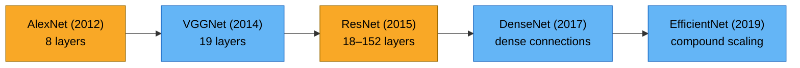

Before ResNet, networks deeper than ~20 layers suffered from **vanishing gradients**—the training signal decayed exponentially as it propagated backward through many layers. ResNet solved this with a deceptively simple idea: instead of learning a direct mapping $H(x)$, learn the *residual* $F(x) = H(x) - x$, and compute the output as $F(x) + x$. This identity shortcut provides a gradient highway that allows networks to scale to hundreds of layers.

$$\text{output} = F(x) + x$$

Where $F(x)$ is the residual function learned by stacked layers, and $x$ is the identity shortcut.

---

## The Complete Inference Pipeline

Before diving into code, here is the full picture of what happens when an image goes in and a label comes out:

```mermaid
flowchart LR
    classDef data fill:#e1f5fe,stroke:#03a9f4,color:#000
    classDef proc fill:#fff3e0,stroke:#ff9800,color:#000
    classDef model fill:#e8f5e9,stroke:#4caf50,color:#000
    classDef out fill:#f3e5f5,stroke:#9c27b0,color:#000

    IMG["🖼️ Raw Image<br/>(H × W × 3, uint8)"]:::data
    RESIZE["Resize<br/>shortest edge → 256"]:::proc
    CROP["Center Crop<br/>224 × 224"]:::proc
    NORM["Normalize<br/>ImageNet μ, σ"]:::proc
    TENSOR["Input Tensor<br/>(1, 3, 224, 224) float32"]:::data
    EMBED["Embedder<br/>Conv7×7 + MaxPool"]:::model
    ENC["Encoder<br/>4 Stages × 2 Blocks"]:::model
    POOL["Global Avg Pool<br/>(1, 512, 1, 1) → (1, 512)"]:::model
    FC["Linear Classifier<br/>512 → 1000"]:::model
    LOGITS["Logits (1, 1000)"]:::out
    ARGMAX["argmax → label"]:::out

    IMG --> RESIZE --> CROP --> NORM --> TENSOR
    TENSOR --> EMBED --> ENC --> POOL --> FC --> LOGITS --> ARGMAX
```

Every box in this diagram is a concrete computation. By the end of this guide, you will have seen the code for each one.

---

## Stage 1: The Black Box (`resnet18.py`)

This is where most tutorials end. HuggingFace's `transformers` library abstracts *everything*:

```python
import os
from transformers import AutoImageProcessor, AutoModelForImageClassification
import torch
from datasets import load_dataset

home = os.path.expanduser("~")
dataset_path = home + "/dataset/cats-image"
model_path = home + "/models/resnet-18"

dataset = load_dataset(dataset_path)
image = dataset["test"]["image"][0]

image_processor = AutoImageProcessor.from_pretrained(model_path)
model = AutoModelForImageClassification.from_pretrained(model_path)

inputs = image_processor(image, return_tensors="pt")

with torch.no_grad():
    logits = model(**inputs).logits

predicted_label = logits.argmax(-1).item()
print(model.config.id2label[predicted_label])
```

### What This Hides

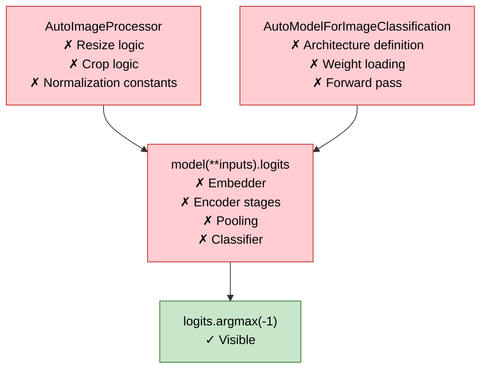

`AutoImageProcessor` hides the resize-crop-normalize pipeline. `AutoModelForImageClassification` hides the architecture. `model(**inputs)` hides the forward pass. The only visible operation is `argmax`. This is convenient for production but useless for understanding.

---

## Stage 2: Opening the Preprocessing Box (`resnet18-simple.py`)

The first step toward understanding is to replace `AutoImageProcessor` with explicit code. The preprocessing for ImageNet-trained models follows a fixed protocol:

```python
def preprocess_image(image: Image.Image) -> torch.Tensor:
    # Step 1: Resize — shortest edge to 256, preserve aspect ratio
    aspect_ratio = image.width / image.height
    if image.width < image.height:
        new_w, new_h = 256, int(round(256 / aspect_ratio))
    else:
        new_w, new_h = int(round(256 * aspect_ratio)), 256
    image = image.resize((new_w, new_h), Image.Resampling.BILINEAR)

    # Step 2: Center crop to 224×224
    left = (new_w - 224) // 2
    top = (new_h - 224) // 2
    image = image.crop((left, top, left + 224, top + 224))

    # Step 3: Scale pixel values from [0, 255] to [0, 1]
    img_array = np.array(image, dtype=np.float32) / 255.0

    # Step 4: Normalize with ImageNet statistics
    mean = np.array([0.485, 0.456, 0.406], dtype=np.float32)
    std = np.array([0.229, 0.224, 0.225], dtype=np.float32)
    img_array = (img_array - mean) / std

    # Step 5: Transpose from (H, W, C) to (C, H, W) — PyTorch convention
    img_array = np.transpose(img_array, (2, 0, 1))

    # Step 6: Add batch dimension → (1, C, H, W)
    inputs = torch.tensor(img_array).unsqueeze(0)
    return inputs
```

### The Preprocessing Mathematics

Each step has a precise mathematical definition.

#### Step 1 — Aspect-Preserving Resize

Given an image of dimensions $(W_{orig}, H_{orig})$, resize so the shortest edge becomes 256:

$$
(W_{new}, H_{new}) = \begin{cases}
\left(256, \; \left\lfloor \frac{256}{\text{aspect}} + 0.5 \right\rfloor\right) & \text{if } W_{orig} < H_{orig} \\[6pt]
\left(\left\lfloor 256 \cdot \text{aspect} + 0.5 \right\rfloor, \; 256\right) & \text{otherwise}
\end{cases}
$$

Where $\text{aspect} = W_{orig} / H_{orig}$.

#### Step 2 — Center Crop

Extract a 224×224 region from the center:

$$
\text{left} = \left\lfloor \frac{W_{new} - 224}{2} \right\rfloor, \quad
\text{top} = \left\lfloor \frac{H_{new} - 224}{2} \right\rfloor
$$

#### Step 3 — Rescaling

Convert from 8-bit unsigned integers to unit-interval floats:

$$
x_{scaled} = \frac{x_{pixel}}{255}
$$

#### Step 4 — ImageNet Normalization

The ImageNet training set has empirically measured per-channel statistics. Normalization centers and scales the data to match the distribution the model was trained on:

$$
x_{norm}^{(c)} = \frac{x_{scaled}^{(c)} - \mu_c}{\sigma_c}
$$

| Channel | Mean ($\mu$) | Std ($\sigma$) |
|---------|-------------|----------------|
| Red     | 0.485       | 0.229          |
| Green   | 0.456       | 0.224          |
| Blue    | 0.406       | 0.225          |

#### Step 5 — Axis Transpose

PIL/NumPy images are stored as $(H, W, C)$ — height, width, channels. PyTorch expects $(C, H, W)$ — channels first. This is a pure memory layout change, no arithmetic involved.

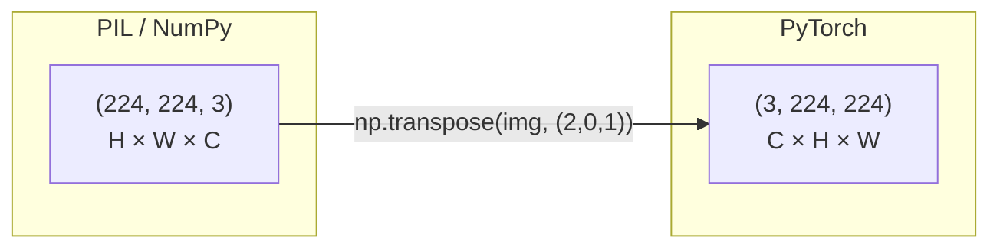

#### Step 6 — Batch Dimension

Neural networks always expect a batch dimension as the first axis. Even for single-image inference, we add a leading dimension of size 1:

$$(C, H, W) \xrightarrow{\text{unsqueeze}(0)} (1, C, H, W)$$

### The Preprocessed Tensor

After all six steps, the input is a `torch.Tensor` of shape `(1, 3, 224, 224)` with dtype `float32`. Pixel values are no longer in $[0, 255]$ or $[0, 1]$; they are centered around zero with values approximately in $[-2.1, 2.6]$ depending on the channel.

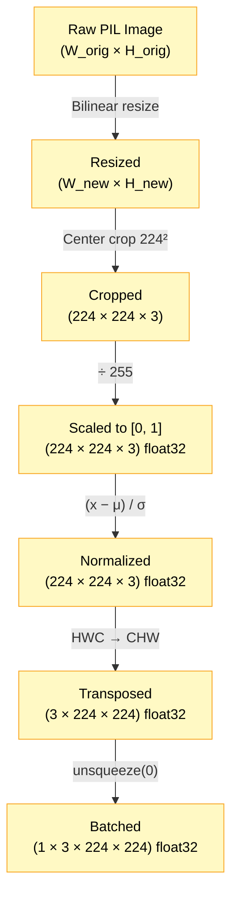

### What Stage 2 Still Hides

The model forward pass remains a black box. At this point, `resnet18-simple.py` still calls into HuggingFace's internals:

```python
with torch.no_grad():
    outputs = model.resnet(inputs)
    pooled_output = outputs.pooler_output
    flattened_output = pooled_output.flatten(1)
    logits = model.classifier(flattened_output)
```

The model is accessed through HuggingFace's `ResNetModel` wrapper, which internally constructs the embedder and encoder but hides their implementation. We see `pooler_output` and `classifier`, but not what happens inside `model.resnet(inputs)`. Let us fix that.

---

## Stage 3: The Complete Open Box (`resnet18-pytorch-pipeline.py`)

This is the core of the guide. We rebuild *every component* of ResNet-18 from raw PyTorch primitives: `nn.Conv2d`, `nn.BatchNorm2d`, `nn.Linear`, `nn.MaxPool2d`. No `transformers` library. No `AutoModel`. Every layer is visible.

### The Full Architecture

```mermaid
flowchart TD
    classDef embed fill:#e1f5fe,stroke:#039be5,color:#000
    classDef stage fill:#fff3e0,stroke:#ff9800,color:#000
    classDef pool fill:#e8f5e9,stroke:#43a047,color:#000
    classDef clf fill:#f3e5f5,stroke:#8e24aa,color:#000
    classDef shape fill:#fafafa,stroke:#bdbdbd,color:#555,font-size:10px

    INPUT["Input<br/>(1, 3, 224, 224)"]:::shape

    subgraph Embedder["Embedder"]
        CONV7["Conv2d 7×7<br/>3 → 64, stride=2, pad=3"]:::embed
        BN0["BatchNorm2d(64)"]:::embed
        RELU0["ReLU"]:::embed
        MAXP["MaxPool2d 3×3<br/>stride=2, pad=1"]:::embed
    end

    subgraph Stage0["Encoder Stage 0 — 64 channels"]
        B00["BasicLayer 0<br/>(64→64, stride=1)"]:::stage
        B01["BasicLayer 1<br/>(64→64, stride=1)"]:::stage
    end

    subgraph Stage1["Encoder Stage 1 — 128 channels"]
        B10["BasicLayer 0<br/>(64→128, stride=2, shortcut)"]:::stage
        B11["BasicLayer 1<br/>(128→128, stride=1)"]:::stage
    end

    subgraph Stage2["Encoder Stage 2 — 256 channels"]
        B20["BasicLayer 0<br/>(128→256, stride=2, shortcut)"]:::stage
        B21["BasicLayer 1<br/>(256→256, stride=1)"]:::stage
    end

    subgraph Stage3["Encoder Stage 3 — 512 channels"]
        B30["BasicLayer 0<br/>(256→512, stride=2, shortcut)"]:::stage
        B31["BasicLayer 1<br/>(512→512, stride=1)"]:::stage
    end

    GAP["Adaptive Avg Pool<br/>(1, 512, 1, 1)"]:::pool
    FLAT["Flatten<br/>(1, 512)"]:::clf
    FC["Linear<br/>512 → 1000"]:::clf
    OUT["Logits (1, 1000)"]:::shape

    INPUT --> CONV7 --> BN0 --> RELU0 --> MAXP
    MAXP --> B00 --> B01
    B01 --> B10 --> B11
    B11 --> B20 --> B21
    B21 --> B30 --> B31
    B31 --> GAP --> FLAT --> FC --> OUT
```

### Component 1: ResNetConvLayer — The Fundamental Building Block

Every convolution in ResNet follows the same pattern: **Conv2d → BatchNorm → (optional) ReLU**. This is so universal it deserves its own module:

```python
class ResNetConvLayer(nn.Module):
    def __init__(self, in_c, out_c, kernel_size, stride=1, padding=0, activation=True):
        super().__init__()
        self.convolution = nn.Conv2d(in_c, out_c, kernel_size,
                                     stride=stride, padding=padding, bias=False)
        self.normalization = nn.BatchNorm2d(out_c)
        self.has_activation = activation

    def forward(self, x):
        x = self.normalization(self.convolution(x))
        return F.relu(x) if self.has_activation else x
```

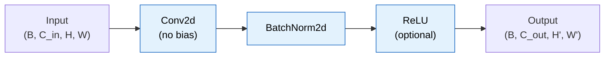

**Why no bias in Conv2d?** Because BatchNorm immediately follows. BatchNorm subtracts the mean and adds its own learnable bias ($\beta$), making the convolution bias redundant. Setting `bias=False` saves parameters.

#### The Convolution Operation

A 2D convolution slides a kernel of size $K \times K$ over the spatial dimensions of the input. For each output position $(i, j)$, the operation is:

$$
\text{out}(b, c_{out}, i, j) = \sum_{c_{in}=0}^{C_{in}-1} \sum_{k_h=0}^{K-1} \sum_{k_w=0}^{K-1} W(c_{out}, c_{in}, k_h, k_w) \cdot x(b, c_{in}, i \cdot s + k_h, j \cdot s + k_w)
$$

Where $s$ is the stride and $W$ is the learned kernel weight tensor.

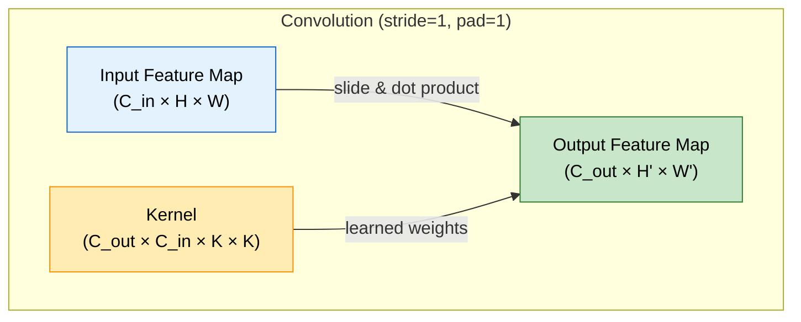

**Output spatial dimensions:**

$$
H_{out} = \left\lfloor \frac{H_{in} + 2P - K}{S} \right\rfloor + 1
$$

$$
W_{out} = \left\lfloor \frac{W_{in} + 2P - K}{S} \right\rfloor + 1
$$

Where $P$ is the padding and $S$ is the stride.

#### Batch Normalization

Batch Normalization (Ioffe & Szegedy, 2015) normalizes each channel's activations across the batch to have zero mean and unit variance, then applies a learnable affine transform:

$$
\hat{x}_c = \frac{x_c - \mu_c}{\sqrt{\sigma_c^2 + \epsilon}}
$$

$$
y_c = \gamma_c \cdot \hat{x}_c + \beta_c
$$

Where:
- $\mu_c$ is the running mean for channel $c$ (computed during training, fixed during inference)
- $\sigma_c^2$ is the running variance for channel $c$
- $\gamma_c$ (weight) and $\beta_c$ (bias) are learned scale and shift parameters
- $\epsilon = 10^{-5}$ prevents division by zero

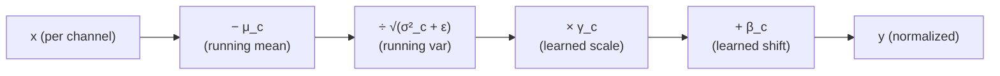

**Why BatchNorm matters for inference:** During training, $\mu_c$ and $\sigma_c^2$ are computed per-batch. During inference, they are replaced with `running_mean` and `running_var`—exponential moving averages accumulated over the entire training set. This makes inference deterministic regardless of batch size.

#### ReLU Activation

The Rectified Linear Unit is the simplest nonlinear activation function:

$$
\text{ReLU}(x) = \max(0, x)
$$

It introduces nonlinearity while preserving gradient flow for positive activations. Every ResNetConvLayer applies ReLU after BatchNorm, *except* the second convolution in each residual block (where activation is deferred until after the residual addition).

---

### Component 2: ResNetShortCut — The Identity Bridge

When a residual block changes the number of channels or the spatial resolution (via stride > 1), the identity shortcut $x$ no longer has the same shape as $F(x)$. A 1×1 convolution projects $x$ to match:

```python
class ResNetShortCut(nn.Module):
    def __init__(self, in_c, out_c, stride):
        super().__init__()
        self.convolution = nn.Conv2d(in_c, out_c, kernel_size=1,
                                     stride=stride, bias=False)
        self.normalization = nn.BatchNorm2d(out_c)

    def forward(self, x):
        return self.normalization(self.convolution(x))
```

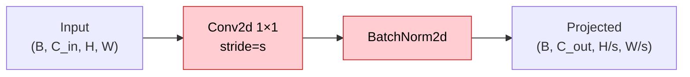

The 1×1 convolution simultaneously changes the channel count and downsamples spatially (via stride). Its mathematical formulation reduces to a per-pixel linear transformation (matrix multiplication across channels):

$$
\text{shortcut}(b, c_{out}, i, j) = \sum_{c_{in}=0}^{C_{in}-1} W(c_{out}, c_{in}) \cdot x(b, c_{in}, i \cdot s, j \cdot s)
$$

---

### Component 3: ResNetBasicLayer — The Residual Block

This is where the residual connection lives. Each basic layer contains two 3×3 convolution layers and an optional shortcut:

```python
class ResNetBasicLayer(nn.Module):
    def __init__(self, in_c, out_c, stride, use_shortcut=False):
        super().__init__()
        self.layer = nn.ModuleList([
            ResNetConvLayer(in_c, out_c, 3, stride=stride, padding=1, activation=True),
            ResNetConvLayer(out_c, out_c, 3, stride=1, padding=1, activation=False)
        ])
        self.shortcut = ResNetShortCut(in_c, out_c, stride) if use_shortcut \
                        else nn.Identity()

    def forward(self, x):
        residual = self.shortcut(x)
        out = self.layer[0](x)
        out = self.layer[1](out)
        return F.relu(out + residual)
```

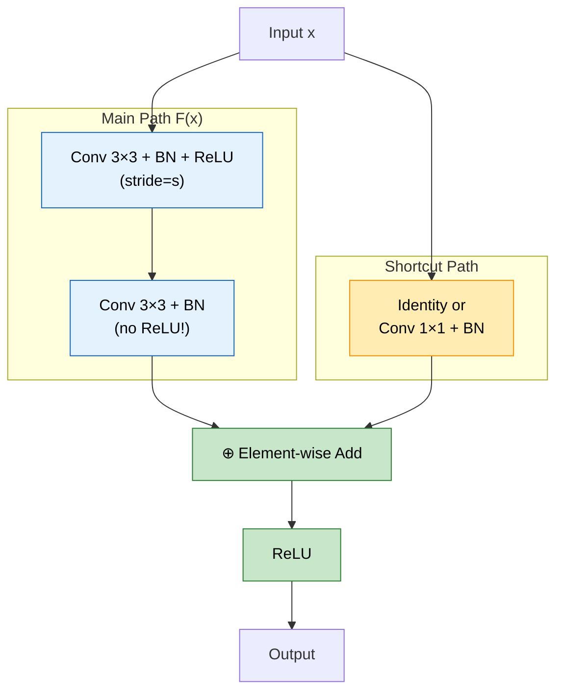

**The critical design detail:** The second convolution has `activation=False`. ReLU is applied *after* the residual addition, not before. This matters because:

$$
\text{output} = \text{ReLU}(F(x) + \text{shortcut}(x))
$$

If ReLU were applied to $F(x)$ before adding the shortcut, negative residuals would be zeroed out, breaking the gradient highway.

#### When Is a Shortcut Needed?

| Condition | Shortcut Type | Purpose |
|-----------|--------------|---------|
| $C_{in} = C_{out}$ and $S = 1$ | `nn.Identity()` | Dimensions match, direct addition |
| $C_{in} \neq C_{out}$ or $S > 1$ | `ResNetShortCut` | Project channels and/or downsample |

In ResNet-18, shortcuts are used at the beginning of Stages 1, 2, and 3 (where the channel count doubles and spatial resolution halves).

---

### Component 4: ResNetStage — Two Blocks, One Resolution

Each stage groups two basic layers. The first may downsample (stride=2); the second always keeps the same resolution:

```python
class ResNetStage(nn.Module):
    def __init__(self, in_c, out_c, stride, use_shortcut):
        super().__init__()
        self.layers = nn.ModuleList([
            ResNetBasicLayer(in_c, out_c, stride, use_shortcut=use_shortcut),
            ResNetBasicLayer(out_c, out_c, 1, use_shortcut=False)
        ])

    def forward(self, x):
        x = self.layers[0](x)
        return self.layers[1](x)
```

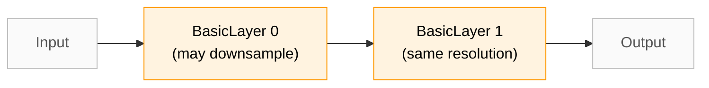

---

### Component 5: ResNetEncoder — The Four-Stage Backbone

The encoder chains all four stages, progressively increasing channels and decreasing spatial resolution:

```python
class ResNetEncoder(nn.Module):
    def __init__(self):
        super().__init__()
        self.stages = nn.ModuleList([
            ResNetStage(64,  64,  1, False),   # Stage 0: 56×56, 64ch
            ResNetStage(64,  128, 2, True),    # Stage 1: 28×28, 128ch (↓2×)
            ResNetStage(128, 256, 2, True),    # Stage 2: 14×14, 256ch (↓2×)
            ResNetStage(256, 512, 2, True)     # Stage 3: 7×7,   512ch (↓2×)
        ])

    def forward(self, x):
        for stage in self.stages:
            x = stage(x)
        return x
```

### The Spatial Resolution Journey

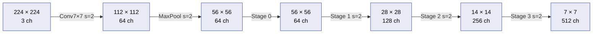

Each stage halves the spatial dimensions and doubles the channels (except Stage 0 which preserves both). This is a common design principle: spatial resolution is traded for richer feature representations.

$$
\text{Total feature volume at each stage:} \quad C \times H \times W
$$

| Stage | Channels | Spatial | Volume (C×H×W) |
|-------|----------|---------|----------------|
| Input | 3 | 224×224 | 150,528 |
| After Embedder | 64 | 56×56 | 200,704 |
| Stage 0 | 64 | 56×56 | 200,704 |
| Stage 1 | 128 | 28×28 | 100,352 |
| Stage 2 | 256 | 14×14 | 50,176 |
| Stage 3 | 512 | 7×7 | 25,088 |

The total activation volume shrinks by 8× from Stage 0 to Stage 3, but the number of channels grows by 8×. Information is progressively compressed from spatial patterns into channel-wise semantic features.

---

### Component 6: ResNetEmbedder — The Entry Point

The embedder takes the raw 3-channel image and produces the initial 64-channel feature map via a large 7×7 convolution followed by max pooling:

```python
class ResNetEmbedder(nn.Module):
    def __init__(self):
        super().__init__()
        self.embedder = ResNetConvLayer(3, 64, kernel_size=7,
                                        stride=2, padding=3, activation=True)
        self.pooler = nn.MaxPool2d(kernel_size=3, stride=2, padding=1)

    def forward(self, x):
        return self.pooler(self.embedder(x))
```

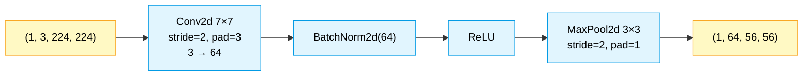

**The 7×7 convolution** has a large receptive field to capture low-level features (edges, textures, color gradients) from the raw image. The spatial dimensions reduce from 224 to 112 (stride=2), then to 56 (MaxPool stride=2).

$$
H_{after\_conv} = \left\lfloor \frac{224 + 2 \times 3 - 7}{2} \right\rfloor + 1 = \left\lfloor \frac{223}{2} \right\rfloor + 1 = 112
$$

$$
H_{after\_pool} = \left\lfloor \frac{112 + 2 \times 1 - 3}{2} \right\rfloor + 1 = \left\lfloor \frac{111}{2} \right\rfloor + 1 = 56
$$

#### MaxPool2d

Max pooling selects the maximum value in each pooling window, providing translation invariance and spatial downsampling:

$$
\text{MaxPool}(x)_{b,c,i,j} = \max_{(k_h, k_w) \in K} x_{b, c, \; i \cdot s + k_h, \; j \cdot s + k_w}
$$

---

### Component 7: The Full ResNet-18 Assembly

Everything comes together:

```python
class ResNet18(nn.Module):
    def __init__(self, num_classes=1000):
        super().__init__()
        self.resnet = nn.ModuleDict({
            "embedder": ResNetEmbedder(),
            "encoder": ResNetEncoder()
        })
        self.classifier = nn.Sequential(
            nn.Flatten(),
            nn.Linear(512, num_classes)
        )

    def forward(self, x):
        x = self.resnet["embedder"](x)
        x = self.resnet["encoder"](x)
        x = F.adaptive_avg_pool2d(x, (1, 1))
        return self.classifier(x)
```

#### The Naming Convention

The module names are carefully chosen to match the HuggingFace `safetensors` checkpoint keys exactly:

```mermaid
flowchart TD
    classDef key fill:#e8eaf6,stroke:#3f51b5,color:#000
    classDef val fill:#c8e6c9,stroke:#2e7d32,color:#000

    ROOT["Model Root"]
    R_E["resnet.embedder.*"]:::key
    R_EN["resnet.encoder.*"]:::key
    CL["classifier.1.*"]:::key

    ROOT --> R_E
    ROOT --> R_EN
    ROOT --> CL

    R_E --> E1["resnet.embedder.embedder.convolution.weight"]:::val
    R_E --> E2["resnet.embedder.embedder.normalization.weight"]:::val
    R_E --> E3["resnet.embedder.embedder.normalization.bias"]:::val
    R_E --> E4["resnet.embedder.embedder.normalization.running_mean"]:::val
    R_E --> E5["resnet.embedder.embedder.normalization.running_var"]:::val

    R_EN --> S0["resnet.encoder.stages.0.layers.0.layer.0.convolution.weight"]:::val
    R_EN --> S0BN["resnet.encoder.stages.0.layers.0.layer.0.normalization.weight"]:::val
    R_EN --> SC["resnet.encoder.stages.1.layers.0.shortcut.convolution.weight"]:::val

    CL --> CW["classifier.1.weight (1000 × 512)"]:::val
    CL --> CB["classifier.1.bias (1000,)"]:::val
```

**Why `classifier.1`?** The classifier is `nn.Sequential(nn.Flatten(), nn.Linear(...))`. Sequential numbers its submodules `0`, `1`, `2`, etc. `Flatten` is index `0` (no weights), and `Linear` is index `1`. The weight key is therefore `classifier.1.weight`.

This naming parity is critical because it allows:

```python
state_dict = load_file(weights_path)             # safetensors
model.load_state_dict(state_dict, strict=True)    # exact key matching
```

With `strict=True`, every key in the checkpoint must map to a model parameter, and every model parameter must have a checkpoint key. Any mismatch raises an error. This is the strongest possible validation of structural parity.

#### Adaptive Average Pooling

After the encoder produces a $(1, 512, 7, 7)$ feature map, adaptive average pooling reduces the spatial dimensions to $(1, 1)$:

$$
\text{AdaptiveAvgPool}(x)_{b, c} = \frac{1}{H \times W} \sum_{i=0}^{H-1} \sum_{j=0}^{W-1} x_{b, c, i, j}
$$

This is equivalent to taking the mean over all spatial positions for each channel. The result has shape $(1, 512, 1, 1)$.

#### The Linear Classifier

After flattening to $(1, 512)$, a linear layer maps to the 1000 ImageNet classes:

$$
\text{logits} = x W^T + b
$$

Where $W \in \mathbb{R}^{1000 \times 512}$ and $b \in \mathbb{R}^{1000}$.

The output logits are raw scores (unnormalized log-probabilities). The predicted class is simply the index of the maximum value:

$$
\hat{y} = \arg\max_{i} \, \text{logits}_i
$$

---

## The Complete Forward Pass — Step by Step

Let us trace a single image through the entire network with exact tensor shapes:

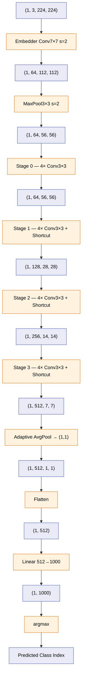

### Layer Count

| Component | Conv Layers | Total Layers |
|-----------|-------------|-------------|
| Embedder | 1 (7×7) | 1 |
| Stage 0 | 4 (3×3) | 4 |
| Stage 1 | 4 (3×3) + 1 (1×1 shortcut) | 5 |
| Stage 2 | 4 (3×3) + 1 (1×1 shortcut) | 5 |
| Stage 3 | 4 (3×3) + 1 (1×1 shortcut) | 5 |
| Classifier | 1 (Linear) | 1 |
| **Total** | | **21** |

The "18" in ResNet-18 refers to the number of layers with *learnable weights* (17 convolutions + 1 linear = 18). The shortcut 1×1 convolutions are typically not counted in the original paper's naming convention, though they do contain learnable parameters.

---

## Weight Loading: From Checkpoint to Graph

The weights are stored in the [safetensors](https://huggingface.co/docs/safetensors/) format—a simple, safe, zero-copy serialization. Loading them is a two-step process:

```python
# 1. Load raw tensor data from safetensors file
weights_path = os.path.join(model_path, "model.safetensors")
state_dict = load_file(weights_path)

# 2. Map tensors to model parameters by name
model.load_state_dict(state_dict, strict=True)
model.eval()   # Switch to inference mode (fixes BatchNorm running stats)
```

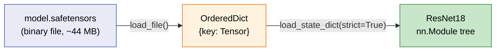

**`model.eval()`** is critical. It switches BatchNorm layers from training mode (computing per-batch statistics) to inference mode (using stored `running_mean` and `running_var`). Forgetting this call will produce incorrect results.

### Parameter Count

$$
\text{Total parameters} = \sum_{\text{layer}} \text{weight\_elements} + \text{bias\_elements}
$$

| Layer Type | Parameters Per Instance | Count in ResNet-18 |
|---|---|---|
| Conv2d 7×7, 3→64 | $64 \times 3 \times 7 \times 7 = 9{,}408$ | 1 |
| Conv2d 3×3, C→C | $C_{out} \times C_{in} \times 3 \times 3$ | 16 |
| Conv2d 1×1 (shortcuts) | $C_{out} \times C_{in} \times 1 \times 1$ | 3 |
| BatchNorm2d(C) | $2C$ (weight + bias) + $2C$ (running stats) | 20 |
| Linear 512→1000 | $512 \times 1000 + 1000 = 513{,}000$ | 1 |
| **Total** | | **~11.7 million** |

---

## The Final Mile: Label Mapping

The 1000-class index is mapped to a human-readable label using the `config.json` that ships with the model:

```python
predicted_idx = logits.argmax(-1).item()

config_path = os.path.join(model_path, "config.json")
with open(config_path, "r") as f:
    config = json.load(f)

label = config["id2label"][str(predicted_idx)]
print(f"\n✅ Expected Output: {label}")
```

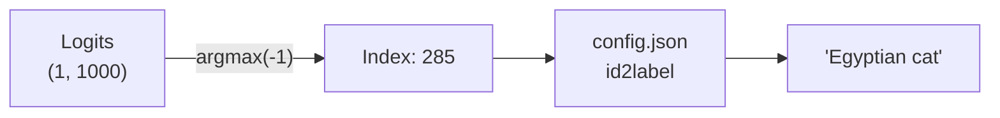

The `id2label` dictionary maps string indices (`"0"` through `"999"`) to ImageNet class names. For our cats dataset, the expected output is one of the cat breeds in the ImageNet-1K taxonomy.

---

## Running the Scripts

### Setup

```bash
# Create directories
mkdir -p $HOME/models/resnet-18
mkdir -p $HOME/dataset/cats-image

# Download model (safetensors + config, no .pth)
hf download microsoft/resnet-18 --local-dir $HOME/models/resnet-18 --exclude='*.pth'

# Download sample cats dataset
hf download huggingface/cats-image --repo-type dataset --local-dir $HOME/dataset/cats-image
```

### Python Environment

```bash
uv venv
source .venv/bin/activate
uv sync
```

### Execution

```bash
# Stage 1: Black box
python3 python/resnet18.py

# Stage 2: Manual preprocessing
python3 python/resnet18-simple.py

# Stage 3: Complete open box
python3 python/resnet18-pytorch-pipeline.py
```

All three scripts must produce the same output for the same input image. This is the strongest validation that the explicit architecture is structurally identical to HuggingFace's implementation.

---

## Summary: What We Opened

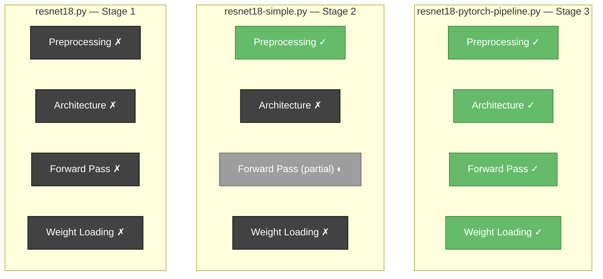

| Aspect | Stage 1 | Stage 2 | Stage 3 |
|--------|---------|---------|---------|
| Image preprocessing | Hidden (`AutoImageProcessor`) | Explicit (NumPy/PIL) | Explicit (NumPy/PIL) |
| Model architecture | Hidden (`AutoModel`) | Hidden (`AutoModel`) | Explicit (custom `nn.Module`) |
| Forward pass | Hidden (`model(**inputs)`) | Partially visible | Fully visible |
| Weight loading | Hidden (`from_pretrained`) | Hidden (`from_pretrained`) | Explicit (`safetensors` → `load_state_dict`) |
| Dependencies | `transformers` + `datasets` | `transformers` + `datasets` + PIL + NumPy | PyTorch + `safetensors` + PIL + NumPy |
| Lines of logic | ~6 | ~30 | ~107 |

---

## What Comes Next: Part 2 — From PyTorch to ZML

With the complete mental model of ResNet-18 now established in Python, Part 2 will translate every component to [ZML](https://zml.ai/) — a tensor framework built in [Zig](https://ziglang.org/) that compiles computation graphs to [MLIR](https://mlir.llvm.org/)/[StableHLO](https://github.com/openxla/stablehlo) and executes them via [PJRT](https://github.com/openxla/xla/blob/main/xla/pjrt/c/pjrt_c_api.h) on CPU, GPU, or TPU.

The structural parity between `resnet18-pytorch-pipeline.py` and `resnet18.zig` is not accidental:

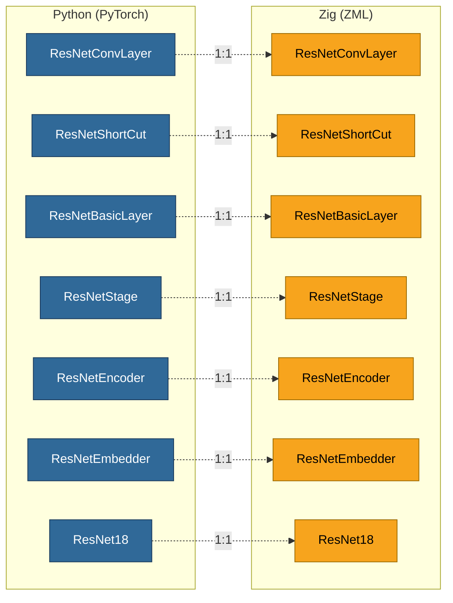

Every Python class maps exactly to a Zig struct. The `safetensors` keys are identical. The forward pass logic is equivalent. The difference is *where* the computation runs: PyTorch dispatches to its eager runtime; ZML traces the computation graph, compiles it via MLIR to StableHLO, and executes it through PJRT on whatever hardware is available.

Part 2 will cover:
- The ZML compilation lifecycle (trace → lower → compile → execute)
- How `zml.Tensor.conv2d` maps to `stablehlo.convolution`
- The monolithic vs. sequential inference pipeline (and why the sequential pipeline matters for Zero-Knowledge Proofs)
- Loading `safetensors` weights via `zml.io.TensorStore`
- Running on CPU, GPU, or TPU via a single `bazel run` command

---

## Prerequisites

* **Python** 3.10+
* **PyTorch** 2.x
* **uv** (for virtual environment management)
* **Hugging Face Hub CLI** (`hf`) (for downloading model weights and datasets)

## References

1. He, K., Zhang, X., Ren, S., & Sun, J. (2015). [Deep Residual Learning for Image Recognition](https://arxiv.org/abs/1512.03385). arXiv:1512.03385.
2. Ioffe, S., & Szegedy, C. (2015). [Batch Normalization: Accelerating Deep Network Training by Reducing Internal Covariate Shift](https://arxiv.org/abs/1502.03167). arXiv:1502.03167.
3. [Microsoft ResNet-18 Model Card](https://huggingface.co/microsoft/resnet-18), Hugging Face.
4. [HuggingFace Transformers — ResNet](https://huggingface.co/docs/transformers/main/en/model_doc/resnet), Official Documentation.
5. [Safetensors Format](https://huggingface.co/docs/safetensors/), Hugging Face.
