# From PyTorch to ZML: ResNet-18 on Compiled Tensor Graphs — Part 2.1

This is **Part 2** of a two-part series. [Part 1](documentation-pytorch.md) dismantled ResNet-18 inference entirely in Python, progressing from a black-box HuggingFace script to a fully explicit PyTorch pipeline. Every convolution, every batch normalization, and every residual connection was made visible.

Now we translate that understanding into [ZML](https://zml.ai/) — a tensor framework built in [Zig](https://ziglang.org/) 0.16 that compiles computation graphs to [MLIR](https://mlir.llvm.org/)/[StableHLO](https://github.com/openxla/stablehlo) and executes them via [PJRT](https://github.com/openxla/xla/blob/main/xla/pjrt/c/pjrt_c_api.h) on CPU, GPU, or TPU.

Part 2 is split into two documents:
- **Part 2.1** (this document): Build system, ZML execution model, and the model architecture in Zig
- **Part 2.2**: The inference pipeline, sequential execution for Zero-Knowledge proofs, and image preprocessing in Zig

---

## Project Architecture

```text
zml-resnet-18/
├── MODULE.bazel              # Bzlmod: Zig 0.16, ZML, LLVM toolchain deps
├── BUILD.bazel               # Top-level: ZLS completion target
├── .bazelrc                  # Bazel configuration (cache, toolchain flags)
└── resnet-18/
    ├── BUILD.bazel           # Bazel targets: zig_library, zig_binary
    ├── main.zig              # Entry point: CLI args, image loading, pipeline init
    ├── pipeline.zig          # Execution engine: generate() and generateSequential()
    ├── resnet18.zig          # Model architecture: ResNet18 struct hierarchy
    └── utils.zig             # Image preprocessing via stb_image (C interop)
```

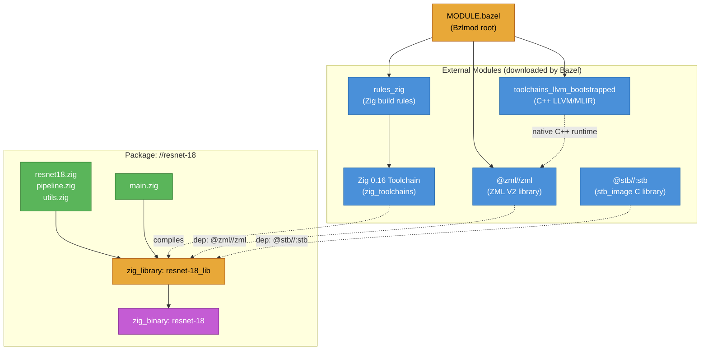

---

## Deep Dive: Bazel as the Build Foundation

### Why Bazel?

ZML V2 relies on LLVM, MLIR, and OpenXLA — a large, multi-language native dependency graph. Zig 0.16 is a pre-release toolchain. Additionally, our project depends on `stb_image` for C-based image loading. Managing this with a Makefile would be unworkable.

Bazel was chosen for three reasons:
1. **Hermetic builds:** Every input is declared. No implicit system dependencies.
2. **Multi-language dependency graph:** Zig, C (stb_image), C++ (LLVM/MLIR), all managed in one dependency graph.
3. **Incremental caching:** Only changed targets are rebuilt. Modifying `resnet18.zig` does not recompile the LLVM toolchain.

### MODULE.bazel — Pinning Dependencies

```starlark
module(
    name = "zml-resnet-18",
    version = "0.1.0",
)

bazel_dep(name = "rules_zig", version = "0.12.3")
bazel_dep(name = "zml", version = "0.0.0")
bazel_dep(name = "rules_cc", version = "0.2.16")
bazel_dep(name = "toolchains_llvm_bootstrapped", version = "0.5.5")
bazel_dep(name = "rules_python", version = "1.8.4")

# Custom rules_zig fork supporting Zig 0.16 ABI
git_override(
    module_name = "rules_zig",
    commit = "7b205b78fb21e11efe5adcc9ec1c37fa5852dc77",
    remote = "https://github.com/zml/rules_zig.git",
)

# Zig 0.16 toolchain — pre-release, pinned to exact build
zig = use_extension("@rules_zig//zig:extensions.bzl", "zig")
zig.toolchain(zig_version = "0.16.0-dev.2722+f16eb18ce")
use_repo(zig, "zig_toolchains")
register_toolchains("@zig_toolchains//:all")

# ZML pinned to a specific commit for reproducibility
git_override(
    module_name = "zml",
    commit = "4ecdd92cb094b26bac96d6281ff91e433c0bc33c",
    remote = "https://github.com/zml/zml.git",
)

# stb_image for C-based image loading (brought in via ZML's third_party)
non_module_deps = use_extension("@zml//:third_party/non_module_deps.bzl", "non_module_deps")
use_repo(non_module_deps, "translate-c", "stb")
```

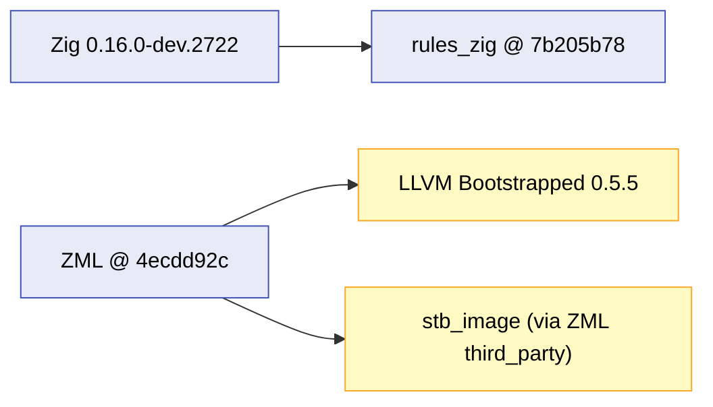

Every dependency is pinned to a specific commit or version. `git_override` locks ZML and `rules_zig` to exact commits, ensuring that the build is reproducible regardless of upstream changes.

### resnet-18/BUILD.bazel — Target Definitions

```starlark
load("@rules_zig//zig:defs.bzl", "zig_library", "zig_binary", "zig_test")

zig_library(
    name = "resnet-18_lib",
    main = "main.zig",
    srcs = [
        "pipeline.zig",
        "resnet18.zig",
        "utils.zig",
    ],
    visibility = ["//visibility:public"],
    deps = [
        "@zml//zml",        # ZML V2 tensor framework
        "@stb//:stb",       # stb_image for C image loading
    ],
)

zig_binary(
    name = "resnet-18",
    deps = [":resnet-18_lib"],
    visibility = ["//visibility:public"],
)
```

Two dependencies are declared:
- **`@zml//zml`** — the ZML V2 tensor framework (which internally depends on MLIR, StableHLO, and PJRT)
- **`@stb//:stb`** — `stb_image` and `stb_image_resize`, used in `utils.zig` for image loading and resizing via Zig's C interop (`@import("c")`)

---

## The ZML V2 Execution Model

Before examining the model code, it is essential to understand ZML's execution model. This is what fundamentally separates ZML from PyTorch.

### PyTorch: Eager Execution

PyTorch executes operations *immediately*. When you write `x = F.relu(self.convolution(x))`, the convolution runs immediately, allocates an output tensor, and returns it. Each operation is dispatched independently.

### ZML: Trace → Lower → Compile → Execute

ZML follows a **deferred execution** model inspired by JAX. Writing `x.conv2d(self.weight, ...)` does *not* execute a convolution. Instead, ZML records the operation in an abstract computation graph. This graph is later compiled to native code and dispatched as a single unit.

```mermaid
flowchart LR
    classDef zig fill:#f9a826,stroke:#9c6a00,color:#000
    classDef trace fill:#64b5f6,stroke:#1565c0,color:#000
    classDef mlir fill:#81c784,stroke:#2e7d32,color:#000
    classDef xla fill:#ba68c8,stroke:#6a1b9a,color:#fff
    classDef hw fill:#ff8a65,stroke:#bf360c,color:#000

    subgraph "1. Zig Frontend"
        direction TB
        Z1["Zig Struct<br/>ResNet18 { ... }"]:::zig
        Z2["zml.Tensor descriptors<br/>(shapes, no data)"]:::zig
        Z3["platform.compile()<br/>triggers tracing"]:::zig
        Z1 --> Z2 --> Z3
    end

    subgraph "2. Intermediate Representations"
        direction TB
        T1["ZML Tracer<br/>records ops as IR graph"]:::trace
        T2["Abstract Operation Graph<br/>(conv2d, add, relu...)"]:::trace
        M1["MLIR Lowering<br/>ZML → StableHLO dialect"]:::mlir
        M2["StableHLO Operations<br/>(stablehlo.convolution)"]:::mlir
        T1 --> T2 --> M1 --> M2
    end

    subgraph "3. Hardware Compilation"
        direction TB
        M3["XLA Dialect Passes<br/>op fusion, placement"]:::mlir
        P1["PJRT Plugin API<br/>agnostic boundary"]:::xla
        P2["OpenXLA Compiler<br/>device-specific kernels"]:::xla
        M3 --> P1 --> P2
    end

    subgraph "4. Execution Backends"
        direction TB
        HW1["CPU (XLA:CPU)"]:::hw
        HW2["NVIDIA (XLA:CUDA)"]:::hw
        HW3["Google TPU (XLA:TPU)"]:::hw
        HW4["Apple (Metal PJRT)"]:::hw
    end

    Z3 --> T1
    M2 --> M3
    P2 --> HW1 & HW2 & HW3 & HW4
```

### The Compilation Contract

The key insight is that **model definition is separate from execution**. In ZML:

1. **Define** the model struct with `zml.Tensor` fields (abstract shape descriptors)
2. **Compile** the model's `forward` function into a hardware-optimized executable
3. **Load** weights from `safetensors` into device buffers
4. **Execute** the compiled graph with real data

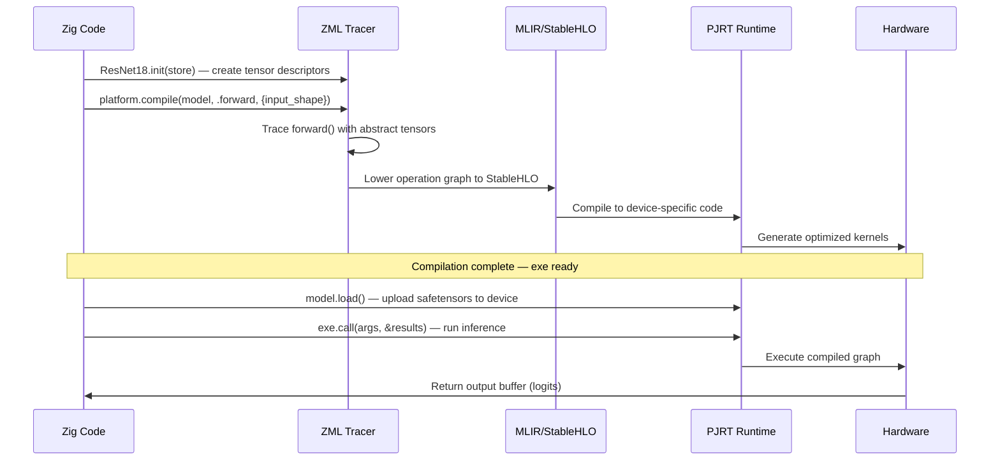

### What is StableHLO?

[StableHLO](https://github.com/openxla/stablehlo) (Stable High-Level Operations) is an opset defined by the [OpenXLA](https://openxla.org/) project. It provides a stable, versioned intermediate representation for ML programs. ZML emits StableHLO from its tensor operations:

| ZML Operation | StableHLO Op |
|---|---|
| `input.conv2d(weight, ...)` | `stablehlo.convolution` |
| `x.add(y)` | `stablehlo.add` |
| `x.relu()` | `stablehlo.maximum(x, 0)` |
| `x.mul(y)` | `stablehlo.multiply` |
| `x.div(y)` | `stablehlo.divide` |
| `x.sub(y)` | `stablehlo.subtract` |
| `x.dot(w, .c)` | `stablehlo.dot_general` |
| `x.mean(dim)` | `stablehlo.reduce` (sum + divide) |
| `x.maxPool2d(...)` | `stablehlo.reduce_window` (max) |
| `x.reshape(shape)` | `stablehlo.reshape` |
| `x.broad(shape)` | `stablehlo.broadcast_in_dim` |

StableHLO is defined as an [MLIR](https://mlir.llvm.org/) dialect. MLIR (Multi-Level Intermediate Representation) is a compiler framework where different abstraction levels ("dialects") can coexist in the same program and be progressively lowered to machine code.

### What is PJRT?

[PJRT](https://github.com/openxla/xla/blob/main/xla/pjrt/c/pjrt_c_api.h) (Plugin JAX Runtime, now generalized) is a hardware-agnostic C API that separates the ML compiler frontend from hardware backends. Any PJRT-compatible plugin (CPU, GPU, TPU, custom accelerators) can be loaded at runtime. ZML uses PJRT to remain hardware-portable without embedding device-specific code.

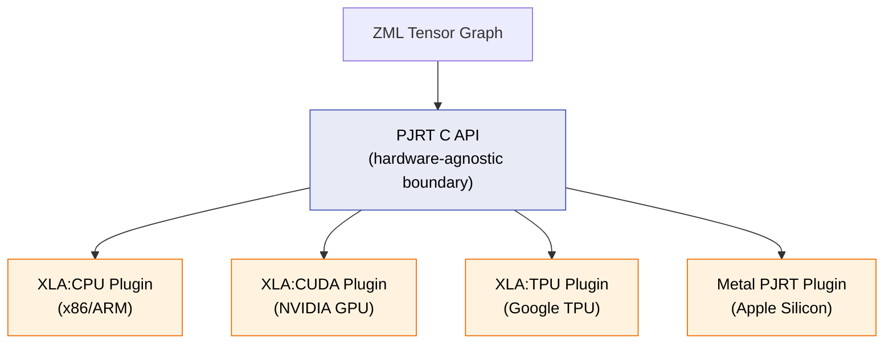

---

## The Model Architecture (`resnet18.zig`)

The Zig model mirrors the Python architecture from Part 1 component-by-component. Every Python `nn.Module` class maps to a Zig `struct`. Every `forward()` method maps to a Zig `pub fn forward()`.

### Structural Parity: Python ↔ Zig

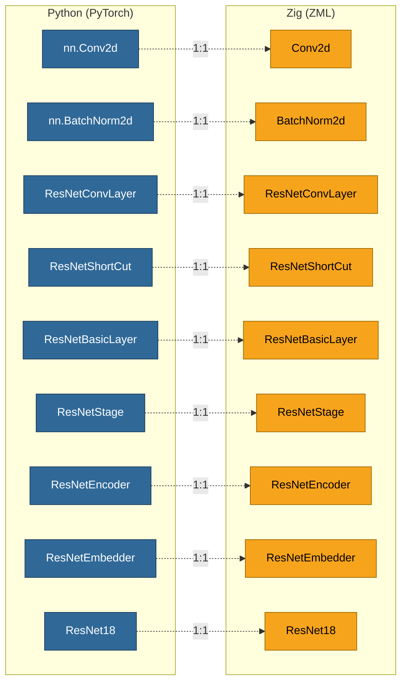

### Component 1: Conv2d — The Convolution Primitive

In PyTorch, `nn.Conv2d` is a black-box module. In ZML, the convolution is expressed as a single tensor operation with explicit parameters:

```zig
const Conv2d = struct {
    weight: zml.Tensor,      // kernel weights: (out, c, kh, kw)
    stride: usize,
    padding: usize,

    pub fn init(store: zml.io.TensorStore.View, stride: usize, padding: usize) Conv2d {
        return .{
            .weight = store.createTensor("weight", .{ .out, .c, .kh, .kw }, .{}),
            .stride = stride,
            .padding = padding,
        };
    }

    pub fn forward(self: Conv2d, input: zml.Tensor) zml.Tensor {
        return input.conv2d(self.weight, .{
            .window_strides = &.{
                @intCast(self.stride), @intCast(self.stride)
            },
            .padding = &.{
                @intCast(self.padding), @intCast(self.padding),
                @intCast(self.padding), @intCast(self.padding)
            },
        });
    }
};
```

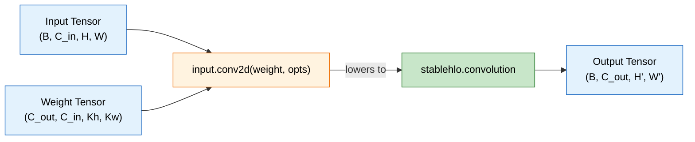

**Key differences from Python:**

| Aspect | Python (`nn.Conv2d`) | Zig (`Conv2d` struct) |
|--------|---------------------|----------------------|
| Weight storage | Internal `Parameter` | `zml.Tensor` field |
| Weight initialization | Random at construction | Loaded from `TensorStore` (safetensors) |
| Execution | Immediate (eager) | Deferred (traced into graph) |
| Dimension naming | Positional | Named: `.out, .c, .kh, .kw` |
| Bias | Optional parameter | Not present (BatchNorm handles it) |

#### Named Dimensions

ZML uses **named dimensions** (`.out`, `.c`, `.kh`, `.kw`) instead of positional integers. This eliminates an entire class of shape bugs:

```zig
// Named dimensions are semantic — the compiler knows what each axis represents
.weight = store.createTensor("weight", .{ .out, .c, .kh, .kw }, .{})
```

The `store.createTensor()` call does not load data — it creates an abstract tensor descriptor with a shape inferred from the safetensors file and named dimensions applied. This descriptor is used during tracing.

#### The Convolution Formula (Recap)

$$
\text{out}(b, c_{out}, i, j) = \sum_{c_{in}} \sum_{k_h} \sum_{k_w} W(c_{out}, c_{in}, k_h, k_w) \cdot x(b, c_{in}, i \cdot s + k_h, j \cdot s + k_w)
$$

In ZML, `input.conv2d(self.weight, ...)` traces this entire operation as a single node in the computation graph. During compilation, it becomes `stablehlo.convolution`, which OpenXLA compiles to hardware-specific optimized kernels (BLAS on CPU, cuDNN on NVIDIA GPU, TPU matrix units on TPU).

---

### Component 2: BatchNorm2d — Explicit Tensor Arithmetic

In PyTorch, `nn.BatchNorm2d` hides the normalization math behind `forward()`. In ZML, every operation is explicitly expressed as tensor arithmetic:

```zig
const BatchNorm2d = struct {
    weight: zml.Tensor,          // γ (scale)
    bias: zml.Tensor,            // β (shift)
    running_mean: zml.Tensor,    // μ (training statistics)
    running_var: zml.Tensor,     // σ² (training statistics)

    pub fn init(store: zml.io.TensorStore.View) BatchNorm2d {
        return .{
            .weight = store.createTensor("weight", .{.c}, .{}),
            .bias = store.createTensor("bias", .{.c}, .{}),
            .running_mean = store.createTensor("running_mean", .{.c}, .{}),
            .running_var = store.createTensor("running_var", .{.c}, .{}),
        };
    }

    pub fn forward(self: BatchNorm2d, input: zml.Tensor) zml.Tensor {
        const eps: f32 = 1e-5;
        const c_dim = self.weight.shape().dim(0);
        const view_shape = zml.Shape.init(.{ 1, c_dim, 1, 1 }, self.weight.dtype());

        // Reshape 1D stats to (1, C, 1, 1) for broadcasting over (B, C, H, W)
        const w = self.weight.reshape(view_shape);
        const b = self.bias.reshape(view_shape);
        const mean = self.running_mean.reshape(view_shape);
        const var_ = self.running_var.reshape(view_shape);

        // Normalize: (x - μ) / √(σ² + ε)
        const normalized = input
            .sub(mean.broad(input.shape()))
            .div(var_.addConstant(eps).sqrt().broad(input.shape()));

        // Scale and shift: γ · x̂ + β
        return normalized
            .mul(w.broad(input.shape()))
            .add(b.broad(input.shape()));
    }
};
```

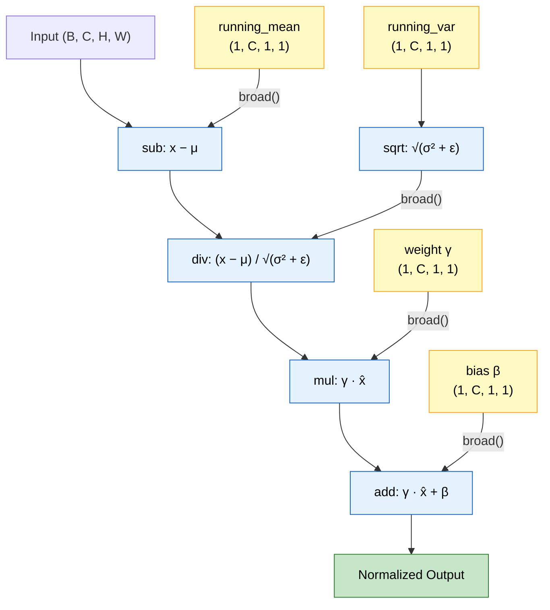

#### Broadcasting: `.broad(input.shape())`

The BatchNorm parameters are 1D tensors of shape `(C,)`. To operate element-wise on a 4D input `(B, C, H, W)`, they must be reshaped to `(1, C, 1, 1)` and then *broadcast* to match the input shape. In ZML:

1. `self.weight.reshape(view_shape)` — reshape `(C,)` → `(1, C, 1, 1)`
2. `.broad(input.shape())` — broadcast `(1, C, 1, 1)` → `(B, C, H, W)`

This corresponds to `stablehlo.broadcast_in_dim` in the compiled graph.

#### The BatchNorm Formula

$$
\hat{x}_c = \frac{x_c - \mu_c}{\sqrt{\sigma_c^2 + \epsilon}}, \quad y_c = \gamma_c \cdot \hat{x}_c + \beta_c
$$

Each ZML operation maps to a StableHLO op:

| Zig Expression | StableHLO Op |
|---|---|
| `input.sub(mean.broad(...))` | `stablehlo.subtract` |
| `var_.addConstant(eps)` | `stablehlo.add` (with constant) |
| `.sqrt()` | `stablehlo.sqrt` |
| `.div(...)` | `stablehlo.divide` |
| `normalized.mul(w.broad(...))` | `stablehlo.multiply` |
| `.add(b.broad(...))` | `stablehlo.add` |

---

### Component 3: ResNetConvLayer — Conv + BN + ReLU

The fundamental building block, identical in structure to the Python version:

```zig
const ResNetConvLayer = struct {
    convolution: Conv2d,
    normalization: BatchNorm2d,
    has_activation: bool,

    pub fn init(store: zml.io.TensorStore.View, stride: usize,
                padding: usize, has_activation: bool) ResNetConvLayer {
        return .{
            .convolution = Conv2d.init(store.withPrefix("convolution"), stride, padding),
            .normalization = BatchNorm2d.init(store.withPrefix("normalization")),
            .has_activation = has_activation,
        };
    }

    pub fn forward(self: ResNetConvLayer, input: zml.Tensor) zml.Tensor {
        var x = self.convolution.forward(input);
        x = self.normalization.forward(x);
        if (self.has_activation) {
            x = x.relu();       // lowers to stablehlo.maximum(x, 0)
        }
        return x;
    }
};
```

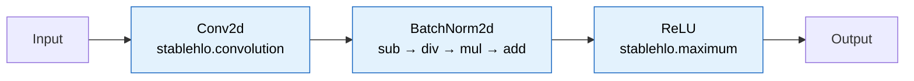

#### The `store.withPrefix()` Mechanism

`store.withPrefix("convolution")` navigates the safetensors key hierarchy. When `ResNetConvLayer.init()` is called with a store view already prefixed to `resnet.encoder.stages.0.layers.0.layer.0`, then:

- `store.withPrefix("convolution")` → `resnet.encoder.stages.0.layers.0.layer.0.convolution`
- Inside `Conv2d.init()`, `store.createTensor("weight", ...)` → `resnet.encoder.stages.0.layers.0.layer.0.convolution.weight`

This mirrors exactly how Python's `nn.Module` names its submodules, ensuring the safetensors keys align.

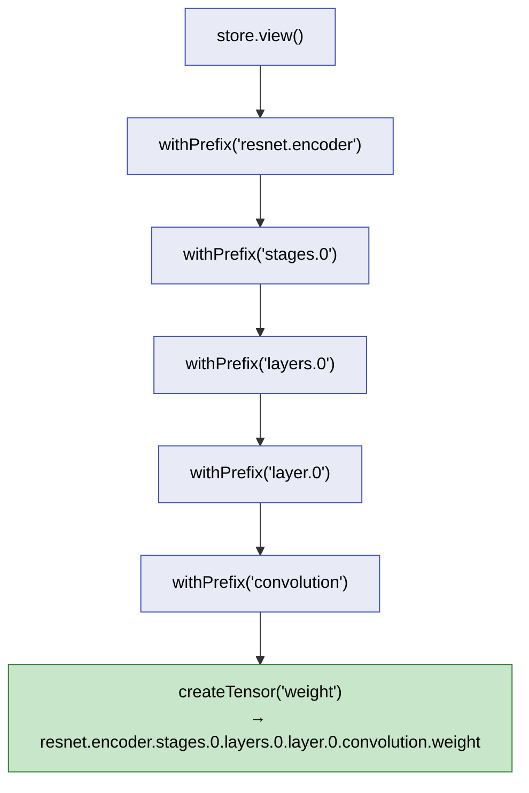

---

### Component 4: ResNetShortCut — 1×1 Projection

```zig
const ResNetShortCut = struct {
    convolution: Conv2d,
    normalization: BatchNorm2d,

    pub fn init(store: zml.io.TensorStore.View, stride: usize) ResNetShortCut {
        return .{
            .convolution = Conv2d.init(store.withPrefix("convolution"), stride, 0),
            .normalization = BatchNorm2d.init(store.withPrefix("normalization")),
        };
    }

    pub fn forward(self: ResNetShortCut, input: zml.Tensor) zml.Tensor {
        const x = self.convolution.forward(input);
        return self.normalization.forward(x);
    }
};
```

The shortcut uses a 1×1 convolution with `padding=0` to project channels and/or downsample spatially. The mathematical formulation is identical to Part 1:

$$
\text{shortcut}(b, c_{out}, i, j) = \sum_{c_{in}} W(c_{out}, c_{in}) \cdot x(b, c_{in}, i \cdot s, j \cdot s)
$$

---

### Component 5: ResNetBasicLayer — The Residual Block

```zig
const ResNetBasicLayer = struct {
    layer0: ResNetConvLayer,
    layer1: ResNetConvLayer,
    shortcut: ?ResNetShortCut,       // Zig optional — null or ResNetShortCut

    pub fn init(store: zml.io.TensorStore.View, stride: usize,
                use_shortcut: bool) ResNetBasicLayer {
        return .{
            .layer0 = ResNetConvLayer.init(store.withPrefix("layer.0"), stride, 1, true),
            .layer1 = ResNetConvLayer.init(store.withPrefix("layer.1"), 1, 1, false),
            .shortcut = if (use_shortcut)
                ResNetShortCut.init(store.withPrefix("shortcut"), stride)
            else
                null,
        };
    }

    pub fn forward(self: ResNetBasicLayer, input: zml.Tensor) zml.Tensor {
        var x = self.layer0.forward(input);
        x = self.layer1.forward(x);

        var residual = input;
        if (self.shortcut) |sc| {
            residual = sc.forward(input);
        }

        return x.add(residual).relu();
    }
};
```

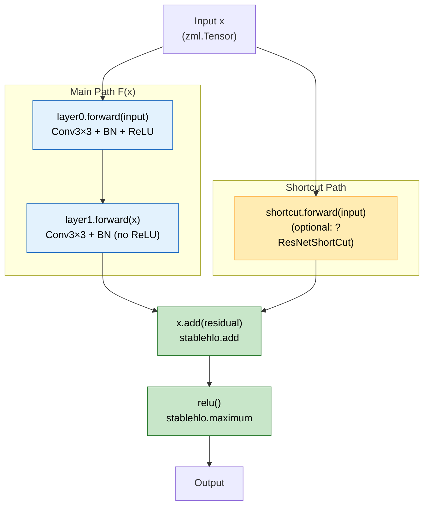

**Zig's optional type (`?ResNetShortCut`)** replaces Python's conditional `nn.Identity()`. When `shortcut` is `null`, the identity path is simply `residual = input` — no extra module, no runtime dispatch.

$$
\text{output} = \text{ReLU}\bigl(F(x) + \text{shortcut}(x)\bigr)
$$

The pattern `if (self.shortcut) |sc|` is Zig's optional unwrapping — it executes the block *only* if the optional has a value, binding it to `sc`.

---

### Component 6: ResNetStage, ResNetEncoder, ResNetEmbedder

These follow the exact same pattern as Part 1. Each stage groups two basic layers; the encoder chains four stages; the embedder applies Conv7×7 + MaxPool:

```zig
const ResNetStage = struct {
    layer0: ResNetBasicLayer,
    layer1: ResNetBasicLayer,

    pub fn init(store: zml.io.TensorStore.View, stride: usize,
                use_shortcut: bool) ResNetStage {
        return .{
            .layer0 = ResNetBasicLayer.init(store.withPrefix("layers.0"), stride, use_shortcut),
            .layer1 = ResNetBasicLayer.init(store.withPrefix("layers.1"), 1, false),
        };
    }

    pub fn forward(self: ResNetStage, input: zml.Tensor) zml.Tensor {
        const x = self.layer0.forward(input);
        return self.layer1.forward(x);
    }
};

const ResNetEncoder = struct {
    stage0: ResNetStage,
    stage1: ResNetStage,
    stage2: ResNetStage,
    stage3: ResNetStage,

    pub fn init(store: zml.io.TensorStore.View) ResNetEncoder {
        return .{
            .stage0 = ResNetStage.init(store.withPrefix("stages.0"), 1, false),
            .stage1 = ResNetStage.init(store.withPrefix("stages.1"), 2, true),
            .stage2 = ResNetStage.init(store.withPrefix("stages.2"), 2, true),
            .stage3 = ResNetStage.init(store.withPrefix("stages.3"), 2, true),
        };
    }

    pub fn forward(self: ResNetEncoder, input: zml.Tensor) zml.Tensor {
        var x = self.stage0.forward(input);
        x = self.stage1.forward(x);
        x = self.stage2.forward(x);
        return self.stage3.forward(x);
    }
};
```

#### ResNetEmbedder — MaxPool in ZML

```zig
const ResNetEmbedder = struct {
    embedder: ResNetConvLayer,

    pub fn init(store: zml.io.TensorStore.View) ResNetEmbedder {
        return .{
            .embedder = ResNetConvLayer.init(store.withPrefix("embedder"), 2, 3, true),
        };
    }

    pub fn forward(self: ResNetEmbedder, input: zml.Tensor) zml.Tensor {
        var x = self.embedder.forward(input);
        return x.maxPool2d(.{
            .window_dimensions = .{ 3, 3 },
            .window_strides = .{ 2, 2 },
            .padding = .{ .{ 1, 1 }, .{ 1, 1 } },
        }).values;
    }
};
```

`maxPool2d` returns a struct with `.values` and `.indices`. We only need `.values`. In StableHLO, this compiles to `stablehlo.reduce_window` with a `max` reduction.

$$
\text{MaxPool}(x)_{b,c,i,j} = \max_{(k_h, k_w) \in K} x_{b, c, \; i \cdot s + k_h, \; j \cdot s + k_w}
$$

---

### Component 7: The Full ResNet18 Assembly

```zig
pub const ResNet18 = struct {
    embedder: ResNetEmbedder,
    encoder: ResNetEncoder,
    classifier_weight: zml.Tensor,
    classifier_bias: zml.Tensor,

    pub fn init(store: zml.io.TensorStore.View) ResNet18 {
        return .{
            .embedder = ResNetEmbedder.init(store.withPrefix("resnet.embedder")),
            .encoder = ResNetEncoder.init(store.withPrefix("resnet.encoder")),
            .classifier_weight = store.createTensor("classifier.1.weight", .{ .out, .c }, .{}),
            .classifier_bias = store.createTensor("classifier.1.bias", .{.out}, .{}),
        };
    }

    pub fn forward(self: ResNet18, input: zml.Tensor) zml.Tensor {
        var x = self.embedder.forward(input);
        x = self.encoder.forward(x);

        // Global average pooling: mean over spatial dims → (1, 512)
        x = x.mean(3).mean(2).reshape(.{ 1, 512 });

        // Linear classifier: x · W^T + b
        const xw = x.withTags(.{ .b, .c });
        const w = self.classifier_weight;
        const b = self.classifier_bias;
        const xw_dot = xw.dot(w, .c);       // contract on .c dimension
        return xw_dot.add(b.broad(xw_dot.shape()));
    }
};
```

#### Global Average Pooling in ZML

PyTorch uses `F.adaptive_avg_pool2d(x, (1, 1))`. ZML achieves the same with explicit mean reductions:

```zig
x = x.mean(3).mean(2).reshape(.{ 1, 512 });
```

- `x.mean(3)` — mean over dimension 3 (width W): `(1, 512, 7, 7)` → `(1, 512, 7)`
- `.mean(2)` — mean over dimension 2 (height H): `(1, 512, 7)` → `(1, 512)`
- `.reshape(.{ 1, 512 })` — ensure shape is exactly `(1, 512)`

$$
\text{AvgPool}(x)_{b, c} = \frac{1}{H \times W} \sum_{i=0}^{H-1} \sum_{j=0}^{W-1} x_{b, c, i, j}
$$

#### The Linear Classifier in ZML

```zig
const xw = x.withTags(.{ .b, .c });         // tag dimensions for dot
const xw_dot = xw.dot(w, .c);               // contract on .c → (b, out)
return xw_dot.add(b.broad(xw_dot.shape()));  // add bias
```

`withTags` assigns semantic labels to each dimension. `dot(w, .c)` contracts the `.c` dimension shared between `xw` (shape `.{.b, .c}` = `{1, 512}`) and `w` (shape `.{.out, .c}` = `{1000, 512}`), producing output shape `.{.b, .out}` = `{1, 1000}`.

$$
\text{logits} = x W^T + b
$$

This compiles to `stablehlo.dot_general` + `stablehlo.add`.

#### Weight Loading — `zml.Bufferized`

The `load` method uploads tensor descriptors to device memory:

```zig
pub fn load(
    self: *const ResNet18,
    allocator: std.mem.Allocator,
    io: std.Io,
    platform: *const zml.Platform,
    store: *const zml.io.TensorStore,
) !zml.Bufferized(ResNet18) {
    const replicated_sharding = try zml.sharding.replicatedSharding(platform);
    return zml.io.load(ResNet18, self, allocator, io, platform, store, .{
        .parallelism = 1,
        .dma_chunks = 1,
        .dma_chunk_size = 16 * 1024 * 1024,
        .shardings = &.{replicated_sharding},
    });
}
```

`zml.Bufferized(ResNet18)` is a compile-time type transformation. It takes the `ResNet18` struct and replaces every `zml.Tensor` field with a `zml.Buffer` — a handle to actual data on the device. The struct hierarchy is preserved, but descriptors become live device memory:

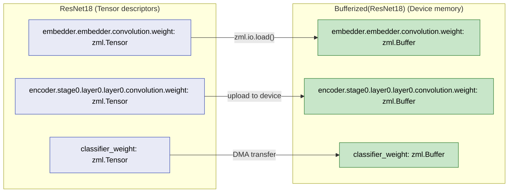

---

## Summary: Architecture Comparison

| Aspect | Python (PyTorch) | Zig (ZML) |
|--------|-----------------|-----------|
| Module system | `nn.Module` classes | Zig `struct` types |
| Forward pass | `def forward(self, x)` | `pub fn forward(self, input: zml.Tensor)` |
| Weight storage | `nn.Parameter` (implicit) | `zml.Tensor` fields (explicit) |
| Weight loading | `load_state_dict()` | `zml.io.load()` → `Bufferized(T)` |
| Key navigation | `nn.Module` autonames | `store.withPrefix()` |
| Execution model | Eager (immediate) | Traced (deferred → compiled) |
| Convolution | `nn.Conv2d(in, out, k)` | `input.conv2d(weight, opts)` |
| BatchNorm | `nn.BatchNorm2d(n)` | Explicit sub/div/mul/add |
| Activation | `F.relu(x)` | `x.relu()` |
| Optional modules | `nn.Identity()` | `?ResNetShortCut` (null) |
| Compilation target | Python bytecode → C++ runtime | MLIR → StableHLO → PJRT |

---

*Continued in [Part 2.2](documentation-zml-2.md): The inference pipeline, sequential execution for Zero-Knowledge proofs, and image preprocessing in Zig.*
