# From PyTorch to ZML: The Inference Pipeline — Part 2.2

*Continued from [Part 2.1](documentation-zml-1.md): Build system, ZML execution model, and model architecture.*

This document covers the runtime side of the ZML ResNet-18 implementation: how the model is compiled and executed, the two inference strategies (monolithic and sequential), image preprocessing in Zig via C interop, and the application entry point.

---

## The Inference Pipeline (`pipeline.zig`)

`pipeline.zig` is the execution engine. It orchestrates:
1. Loading the safetensors checkpoint
2. Compiling the model graph
3. Uploading weights to device memory
4. Running inference
5. Mapping output logits to ImageNet labels

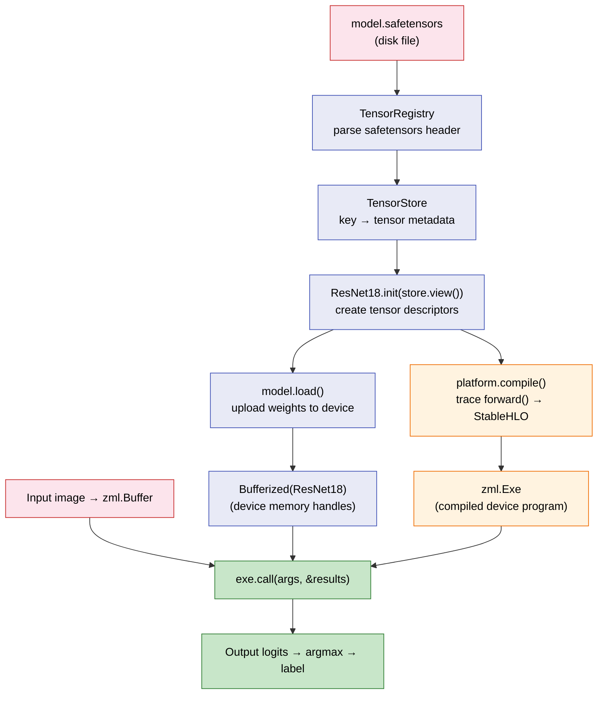

### The Pipeline Struct

```zig
pub const ResNet18Pipeline = struct {
    allocator: std.mem.Allocator,
    io: std.Io,
    platform: *const zml.Platform,

    model: ResNet18,                      // tensor descriptors (shapes)
    exe: zml.Exe,                         // compiled device program
    buffers: zml.Bufferized(ResNet18),    // device memory (weights)

    id2label: std.json.Parsed(std.json.Value),  // config.json label map
};
```

The pipeline holds three representations of the model simultaneously:
- **`model`** — abstract tensor descriptors (shapes, no data)
- **`exe`** — compiled computation graph (MLIR → device code)
- **`buffers`** — actual weight data on device memory

### Loading: From Disk to Device

```zig
pub fn loadFromFile(
    allocator: std.mem.Allocator,
    io: std.Io,
    platform: *const zml.Platform,
    options: LoadOptions,
) !ResNet18Pipeline {
    // 1. Parse safetensors file → tensor registry
    var registry = try zml.safetensors.TensorRegistry.fromPath(
        allocator, io, options.model_path
    );
    defer registry.deinit();

    // 2. Create tensor store (key → shape mapping)
    var store = zml.io.TensorStore.fromRegistry(allocator, &registry);
    defer store.deinit();

    // 3. Initialize model (create abstract tensor descriptors)
    const model_def = ResNet18.init(store.view());

    // 4. Define input shape
    const input: zml.Tensor = .init(.{ 1, 3, 224, 224 }, .f32);

    // 5. Compile: trace forward() with abstract tensors → device code
    const replicated_sharding = try zml.sharding.replicatedSharding(platform);
    const exe = try platform.compile(
        allocator, io, model_def, .forward, .{input},
        .{ .shardings = &.{replicated_sharding} },
    );

    // 6. Upload weights from safetensors → device buffers
    const buffers = try model_def.load(allocator, io, platform, &store);

    // 7. Parse config.json for id2label mapping
    // ... (JSON parsing omitted for brevity)

    return .{
        .allocator = allocator,
        .io = io,
        .platform = platform,
        .model = model_def,
        .exe = exe,
        .buffers = buffers,
        .id2label = parsed_config,
    };
}
```

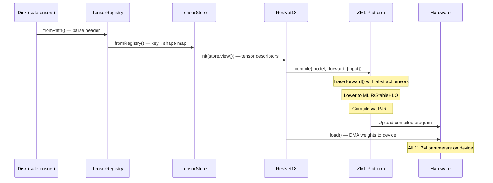

#### The Compilation Call

```zig
const exe = try platform.compile(
    allocator, io,
    model_def,       // the struct with zml.Tensor fields
    .forward,        // which method to trace
    .{input},        // input shape descriptors
    .{ .shardings = &.{replicated_sharding} },
);
```

This single call does everything:
1. Calls `model_def.forward(input)` with **abstract tensors** — no real data flows
2. The ZML tracer records every tensor operation as a node in an IR graph
3. The graph is lowered to StableHLO MLIR
4. StableHLO is compiled via PJRT to device-specific kernels
5. Returns a `zml.Exe` — a handle to the compiled program

The compiled program encodes the *entire* ResNet-18 forward pass as a single fused computation graph. All 17 convolutions, 20 batch normalizations, all ReLU activations, the pooling, and the classifier — all compiled into one executable.

---

## Strategy 1: Monolithic Inference (`generate`)

The standard inference path compiles the entire model as a single graph and executes it in one call:

```zig
pub fn generate(self: *ResNet18Pipeline, tensor_data: []const f32) ![]f32 {
    const replicated_sharding = try zml.sharding.replicatedSharding(self.platform);

    // Upload preprocessed image to device
    var input_buffer = try zml.Buffer.fromSlice(
        self.io, self.platform,
        zml.Slice.init(
            zml.Shape.init(.{ 1, 3, 224, 224 }, .f32),
            std.mem.sliceAsBytes(tensor_data),
        ),
        replicated_sharding,
    );
    defer input_buffer.deinit();

    // Prepare execution arguments
    var args = try self.exe.args(self.allocator);
    defer args.deinit(self.allocator);
    var results = try self.exe.results(self.allocator);
    defer results.deinit(self.allocator);

    // Execute: weights + input → logits
    args.set(.{ self.buffers, input_buffer });
    self.exe.call(args, &results);

    // Download result from device
    var result = results.get(zml.Buffer);
    defer result.deinit();

    const logits = try result.toSliceAlloc(self.allocator, self.io);
    defer logits.free(self.allocator);

    // Argmax over 1000 classes
    const logits_f32 = logits.items(f32);
    var max_val: f32 = -std.math.inf(f32);
    var max_idx: usize = 0;
    for (logits_f32, 0..) |val, i| {
        if (val > max_val) {
            max_val = val;
            max_idx = i;
        }
    }

    // Map index to label via config.json
    const id2label_obj = self.id2label.value.object.get("id2label").?.object;
    var buf: [32]u8 = undefined;
    const key_str = try std.fmt.bufPrint(&buf, "{d}", .{max_idx});
    const label = id2label_obj.get(key_str).?.string;

    log.info("{s}", .{label});
    // ...
}
```

### The Data Flow

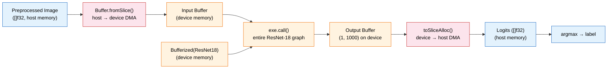

The host-device boundary is explicit in ZML. Data crosses it exactly twice:
1. **Upload:** `Buffer.fromSlice()` — preprocessed image from host → device
2. **Download:** `toSliceAlloc()` — logits from device → host

Everything in between — all 11.7 million parameter operations — runs entirely on the device in a single compiled kernel.

### The Execution Contract: `args.set` and `exe.call`

```zig
args.set(.{ self.buffers, input_buffer });
self.exe.call(args, &results);
```

`args.set` takes a tuple matching the compiled function's signature. During compilation, `platform.compile(model_def, .forward, .{input})` established that the function takes `(ResNet18, zml.Tensor)` — the model struct (weights) and one input tensor. At runtime:

- `self.buffers` (`Bufferized(ResNet18)`) provides the device-resident weights
- `input_buffer` (a `zml.Buffer`) provides the device-resident input image

The call dispatches the compiled StableHLO program through PJRT. No Zig code runs during execution — the entire forward pass is a hardware-native kernel.

---

## Strategy 2: Sequential Inference (`generateSequential`)

This is the architecturally significant innovation. Instead of compiling the entire model as one graph, each stage is compiled and executed independently, yielding intermediate activation tensors between stages.

```mermaid
flowchart TD
    classDef compile fill:#e8eaf6,stroke:#3f51b5,color:#000
    classDef exec fill:#fff3e0,stroke:#ef6c00,color:#000
    classDef buf fill:#c8e6c9,stroke:#2e7d32,color:#000
    classDef yield fill:#fce4ec,stroke:#c62828,color:#000

    INPUT["Input Buffer<br/>(1, 3, 224, 224)"]:::buf

    C1["compile(embedder, .forward)"]:::compile
    E1["embed_exe.call()"]:::exec
    B1["x_embed: Buffer<br/>(1, 64, 56, 56)"]:::buf
    Y1["Intermediate Trace Yield"]:::yield

    C2["compile(stage0, .forward)"]:::compile
    E2["s0_exe.call()"]:::exec
    B2["x_s0: Buffer<br/>(1, 64, 56, 56)"]:::buf
    Y2["Intermediate Trace Yield"]:::yield

    C3["compile(stage1, .forward)"]:::compile
    E3["s1_exe.call()"]:::exec
    B3["x_s1: Buffer<br/>(1, 128, 28, 28)"]:::buf
    Y3["Intermediate Trace Yield"]:::yield

    C4["compile(stage2, .forward)"]:::compile
    E4["s2_exe.call()"]:::exec
    B4["x_s2: Buffer<br/>(1, 256, 14, 14)"]:::buf
    Y4["Intermediate Trace Yield"]:::yield

    C5["compile(stage3, .forward)"]:::compile
    E5["s3_exe.call()"]:::exec
    B5["x_s3: Buffer<br/>(1, 512, 7, 7)"]:::buf
    Y5["Intermediate Trace Yield"]:::yield

    C6["compile(classifier, .forward)"]:::compile
    E6["clf_exe.call()"]:::exec
    B6["Logits: Buffer<br/>(1, 1000)"]:::buf

    INPUT --> C1 --> E1 --> B1 --> Y1
    Y1 --> C2 --> E2 --> B2 --> Y2
    Y2 --> C3 --> E3 --> B3 --> Y3
    Y3 --> C4 --> E4 --> B4 --> Y4
    Y4 --> C5 --> E5 --> B5 --> Y5
    Y5 --> C6 --> E6 --> B6
```

### Why Sequential Execution Exists

This method is designed for **Zero-Knowledge Proofs**. Proving the execution of the full ResNet-18 model (~27.7 million constraints) monolithically would require materializing the entire execution trace in RAM simultaneously — far exceeding hardware limits for current ZK proving systems.

Sequential execution enables **Recursive Layer Folding** (as used in Nova, Sangria, and similar IVC schemes):

```mermaid
flowchart LR
    classDef stage fill:#fff3e0,stroke:#ef6c00,color:#000
    classDef proof fill:#e8eaf6,stroke:#3f51b5,color:#000
    classDef acc fill:#c8e6c9,stroke:#2e7d32,color:#000

    S1["Stage 1<br/>Embedder"]:::stage
    P1["Prove Stage 1<br/>(local constraints)"]:::proof
    A1["Fold into<br/>Accumulator"]:::acc

    S2["Stage 2<br/>Encoder S0"]:::stage
    P2["Prove Stage 2<br/>(local constraints)"]:::proof
    A2["Fold into<br/>Accumulator"]:::acc

    S3["Stage N<br/>Classifier"]:::stage
    P3["Prove Stage N<br/>(local constraints)"]:::proof
    A3["Final Proof<br/>(constant size)"]:::acc

    S1 --> P1 --> A1
    A1 --> S2 --> P2 --> A2
    A2 -.->|"..."| S3 --> P3 --> A3
```

By yielding the intermediate activation tensor after each stage:
- A ZK prover can prove one stage's constraints at a time
- Each stage's proof is "folded" into a constant-sized accumulator
- Memory consumption drops from $O(\text{Depth})$ to $O(\text{Layer})$
- The final proof is constant-sized regardless of network depth

### The Code: Stage-by-Stage Compilation

Each stage is compiled independently by extracting the corresponding sub-struct from the model:

```zig
// --- Embedder Stage ---
const embed_exe = try self.platform.compile(
    self.allocator, self.io,
    self.model.embedder,          // just the embedder sub-struct
    .forward,
    .{zml.Tensor.init(.{ 1, 3, 224, 224 }, .f32)},
    .{ .shardings = &.{replicated_sharding} },
);

var embed_args = try embed_exe.args(self.allocator);
embed_args.set(.{ self.buffers.embedder, input_buffer });
embed_exe.call(embed_args, &embed_results);
var x_embed = embed_results.get(zml.Buffer);
```

Notice the structural symmetry:
- **Compile:** `self.model.embedder` (tensor descriptors for embedder only)
- **Execute:** `self.buffers.embedder` (device weights for embedder only)
- **Output:** `x_embed` (intermediate activation buffer)

The output buffer from one stage becomes the input to the next:

```zig
// --- Encoder Stage 0 ---
const s0_exe = try self.platform.compile(
    self.allocator, self.io,
    self.model.encoder.stage0,    // just stage0
    .forward,
    .{zml.Tensor.init(x_embed.shape(), .f32)},  // input shape from previous output
    .{ .shardings = &.{replicated_sharding} },
);

s0_args.set(.{ self.buffers.encoder.stage0, x_embed });
s0_exe.call(s0_args, &s0_results);
var x_s0 = s0_results.get(zml.Buffer);
x_embed.deinit();   // free previous stage's output
```

**Key detail:** `x_embed.shape()` dynamically determines the input shape for the next stage based on the *actual output* of the previous stage. This chaining is automatic — no manual shape tracking is needed.

### The Classifier Wrapper

The classifier is not a standalone struct in `resnet18.zig` — it is two tensor fields on `ResNet18`. For sequential execution, a local wrapper struct is created inline:

```zig
const ClassifierWrapper = struct {
    classifier_weight: zml.Tensor,
    classifier_bias: zml.Tensor,

    pub fn forward(ctx: @This(), input: zml.Tensor) zml.Tensor {
        // Global average pool + flatten
        var x = input.mean(3).mean(2).reshape(.{ 1, 512 });
        const xw = x.withTags(.{ .b, .c });
        const xw_dot = xw.dot(ctx.classifier_weight, .c);
        return xw_dot.add(ctx.classifier_bias.broad(xw_dot.shape()));
    }
};

const classifier = ClassifierWrapper{
    .classifier_weight = self.model.classifier_weight,
    .classifier_bias = self.model.classifier_bias,
};

const clf_exe = try self.platform.compile(
    self.allocator, self.io,
    classifier, .forward,
    .{zml.Tensor.init(x_s3.shape(), .f32)},
    .{ .shardings = &.{replicated_sharding} },
);
```

This demonstrates a powerful ZML pattern: **any Zig struct with `zml.Tensor` fields and a `forward` method can be compiled**. You can create ad-hoc model fragments at runtime.

### Monolithic vs Sequential: Comparison

| Aspect | `generate()` | `generateSequential()` |
|--------|-------------|----------------------|
| Compilations | 1 | 6 (embedder + 4 stages + classifier) |
| `exe.call()` invocations | 1 | 6 |
| Host-device transfers | 2 (input + output) | 2 (input + output) + 5 intermediate |
| Graph optimization | Full model fusion | Per-stage fusion only |
| Performance | Maximum | Lower (compilation overhead) |
| ZK provability | Intractable ($O(N)$ RAM) | Tractable ($O(1)$ per fold) |
| Memory (ZK prover) | ~27.7M constraints | ~4.6M constraints per stage |

---

## Image Preprocessing (`utils.zig`)

Image preprocessing in Zig mirrors the Python implementation from Part 1, but uses `stb_image` (a C library) for image loading and resizing, interfaced via Zig's `@import("c")`.

```zig
const c_interface = @import("c");   // Zig's C interop — binds to stb_image

pub fn preprocessImage(
    allocator: std.mem.Allocator,
    image_path_str: []const u8,
    crop_size: usize,
) ![]f32 {
    // 1. Load image via stb_image (C FFI)
    var img_width: i32 = 0;
    var img_height: i32 = 0;
    var img_channels: i32 = 0;
    const img_data = c_interface.stbi_load(
        image_path, &img_width, &img_height, &img_channels, 3
    );
    defer c_interface.stbi_image_free(img_data);

    // 2. Resize shortest edge to 256 (aspect-preserving)
    const aspect = @as(f32, @floatFromInt(img_width))
                 / @as(f32, @floatFromInt(img_height));
    var res_w: i32 = 256;
    var res_h: i32 = 256;
    if (img_width < img_height) {
        res_h = @intFromFloat(256.0 / aspect);
    } else {
        res_w = @intFromFloat(256.0 * aspect);
    }

    const resized_data = allocator.alloc(u8, @intCast(res_w * res_h * 3));
    defer allocator.free(resized_data);

    // stb_image_resize (C FFI)
    _ = c_interface.stbir_resize_uint8_linear(
        img_data, img_width, img_height, 0,
        resized_data.ptr, res_w, res_h, 0,
        c_interface.STBIR_RGB,
    );

    // 3. Center crop to 224×224
    const start_x = @divTrunc(res_w - @as(i32, @intCast(crop_size)), 2);
    const start_y = @divTrunc(res_h - @as(i32, @intCast(crop_size)), 2);

    // 4. Normalize + transpose to (C, H, W) in one pass
    var tensor_data = allocator.alloc(f32, 3 * crop_size * crop_size);

    const mean = [_]f32{ 0.485, 0.456, 0.406 };
    const std_ = [_]f32{ 0.229, 0.224, 0.225 };

    for (0..crop_size) |vy| {
        for (0..crop_size) |vx| {
            const y = @intCast(start_y + @as(i32, @intCast(vy)));
            const x = @intCast(start_x + @as(i32, @intCast(vx)));
            const src_idx = (y * @as(usize, @intCast(res_w)) + x) * 3;

            // Scale [0, 255] → [0, 1] and normalize
            const r = @as(f32, @floatFromInt(resized_data[src_idx + 0])) / 255.0;
            const g = @as(f32, @floatFromInt(resized_data[src_idx + 1])) / 255.0;
            const b = @as(f32, @floatFromInt(resized_data[src_idx + 2])) / 255.0;

            const r_norm = (r - mean[0]) / std_[0];
            const g_norm = (g - mean[1]) / std_[1];
            const b_norm = (b - mean[2]) / std_[2];

            // Write directly to (C, H, W) layout — channels first
            tensor_data[0 * (crop_size * crop_size) + vy * crop_size + vx] = r_norm;
            tensor_data[1 * (crop_size * crop_size) + vy * crop_size + vx] = g_norm;
            tensor_data[2 * (crop_size * crop_size) + vy * crop_size + vx] = b_norm;
        }
    }
    return tensor_data;
}
```

### Preprocessing: Python vs Zig

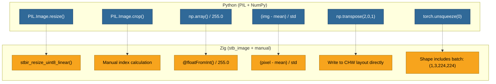

The key difference: Python performs resize, crop, scale, normalize, and transpose as **separate passes** over the data. Zig fuses crop, scale, normalize, and transpose into a **single pass** — each pixel is read once, transformed, and written directly to its `(C, H, W)` destination.

#### The Preprocessing Mathematics (identical to Part 1)

$$
x_{norm}^{(c)} = \frac{x_{pixel}^{(c)} / 255 - \mu_c}{\sigma_c}
$$

| Channel | Mean ($\mu$) | Std ($\sigma$) |
|---------|-------------|----------------|
| Red     | 0.485       | 0.229          |
| Green   | 0.456       | 0.224          |
| Blue    | 0.406       | 0.225          |

#### Memory Layout: HWC → CHW in One Pass

The output index calculation embeds the transpose directly:

```zig
// Channel 0 (Red): starts at offset 0
tensor_data[0 * (224 * 224) + vy * 224 + vx] = r_norm;
// Channel 1 (Green): starts at offset 224*224
tensor_data[1 * (224 * 224) + vy * 224 + vx] = g_norm;
// Channel 2 (Blue): starts at offset 2*224*224
tensor_data[2 * (224 * 224) + vy * 224 + vx] = b_norm;
```

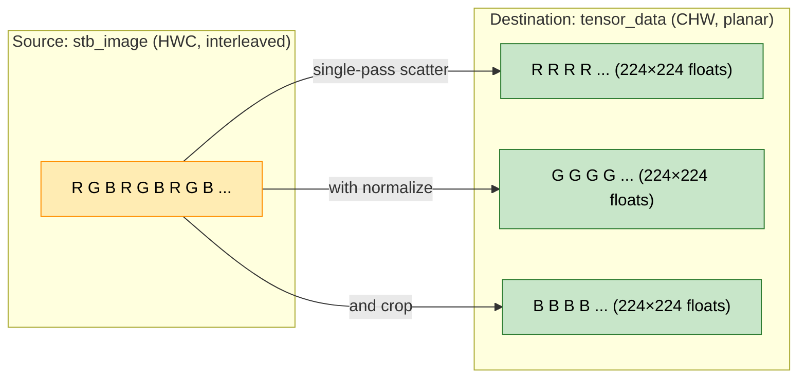

### C Interop: How `@import("c")` Works

Zig can import C headers at compile time and call C functions directly, with no bindings generator. The `@import("c")` directive makes all C symbols from the linked `stb` library available as Zig functions:

```zig
const c_interface = @import("c");

// These are C functions, called as if they were Zig:
c_interface.stbi_load(path, &w, &h, &ch, 3);
c_interface.stbir_resize_uint8_linear(src, ...);
c_interface.stbi_image_free(data);
```

The `@stb//:stb` dependency in `BUILD.bazel` compiles `stb_image.h` and `stb_image_resize2.h` as C and links them into the Zig binary. Zig's type system provides memory safety guarantees on the Zig side while seamlessly calling into C for image I/O.

---

## The Application Entry Point (`main.zig`)

```zig
pub fn main(init: std.process.Init) !void {
    const allocator = init.gpa;
    const io = init.io;

    // Parse CLI arguments
    const cli_args = stdx.flags.parse(init.minimal.args, CliArgs);

    // 1. Load and preprocess image
    const crop_size = 224;
    const tensor_data = try utils.preprocessImage(
        allocator, cli_args.image, crop_size
    );
    defer allocator.free(tensor_data);

    // 2. Initialize ZML platform (auto-detect best device)
    const platform: *zml.Platform = try .auto(allocator, io, .{});
    defer platform.deinit(allocator);

    // 3. Initialize pipeline (load + compile + upload weights)
    var pipeline = try ResNet18Pipeline.loadFromFile(allocator, io, platform, .{
        .model_path = model_path,
        .config_path = config_path,
    });
    defer pipeline.deinit();

    // 4. Run inference
    const logits = try pipeline.generate(tensor_data);
    // Alternative: try pipeline.generateSequential(tensor_data);
    defer allocator.free(logits);
}
```

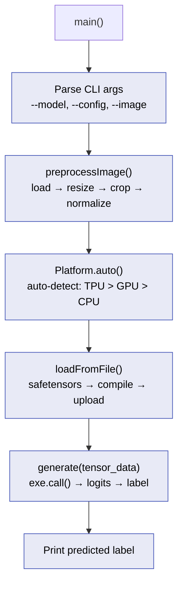

### `zml.Platform.auto()`

```zig
const platform: *zml.Platform = try .auto(allocator, io, .{});
```

This probes the available PJRT plugins and selects the best hardware backend automatically:

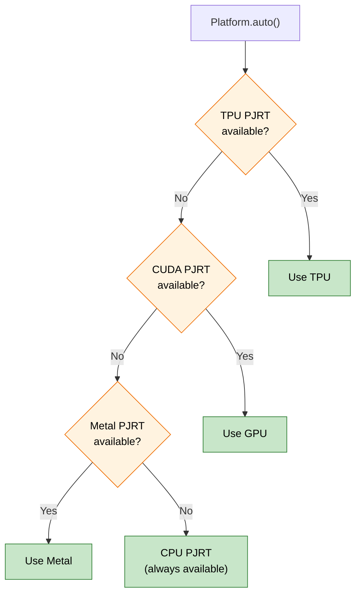

The same binary runs on any supported hardware without code changes. The compiled StableHLO graph is hardware-agnostic; only the PJRT plugin determines how it executes.

### Zig 0.16 Conventions

The `main` function signature uses Zig 0.16's `std.process.Init` pattern:

```zig
pub fn main(init: std.process.Init) !void {
    const allocator = init.gpa;    // general-purpose allocator
    const io = init.io;            // async I/O handle
    // ...
}
```

This replaces the traditional `pub fn main() !void` with explicit dependency injection. The `io: std.Io` is Zig 0.16's abstraction over async I/O and clock access — it is threaded through every ZML call that performs I/O (compilation, buffer transfers, file access).

---

## Running the Application

### Download Model and Dataset

```bash
# Create directories
mkdir -p $HOME/models/resnet-18
mkdir -p $HOME/dataset/cats-image

# Download model (safetensors + config, no .pth)
bazel run @zml//tools/hf:hf -- download microsoft/resnet-18 \
    --local-dir $HOME/models/resnet-18 --exclude='*.pth'

# Download sample cats dataset
bazel run @zml//tools/hf:hf -- download huggingface/cats-image \
    --repo-type dataset --local-dir $HOME/dataset/cats-image
```

### Build and Run

```bash
# Standard inference (monolithic, maximum performance)
bazel run //resnet-18 -- \
    --model=$HOME/models/resnet-18/model.safetensors \
    --config=$HOME/models/resnet-18/config.json \
    --image=$HOME/dataset/cats-image/cats_image.jpeg
```

### What Happens When You Run

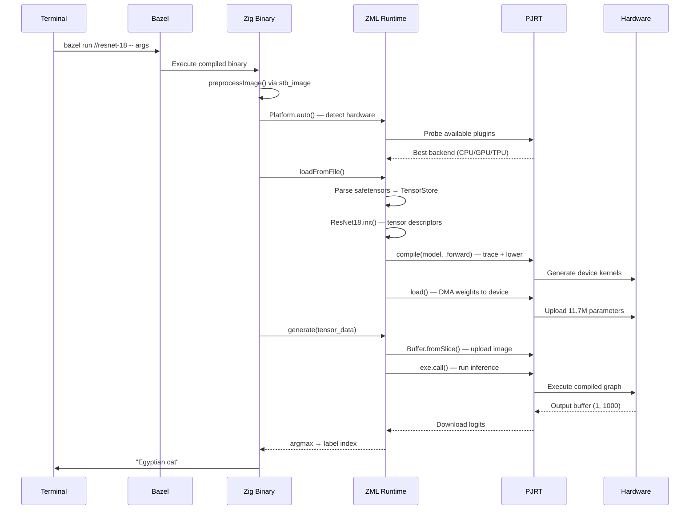

---

## The Full Stack: From Image to Label

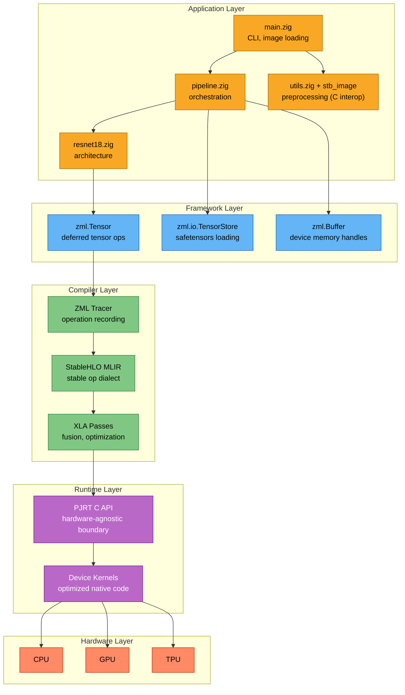

---

## Conclusion: PyTorch vs ZML

Across Parts 1 and 2, we implemented the same model — ResNet-18 — in two fundamentally different paradigms:

| Aspect | PyTorch (Part 1) | ZML (Part 2) |
|--------|-----------------|-------------|
| Language | Python | Zig 0.16 |
| Execution model | Eager (immediate) | Deferred (trace → compile → execute) |
| Build system | pip/uv | Bazel (hermetic, multi-language) |
| Weight format | safetensors | safetensors (same checkpoint) |
| Image loading | PIL + NumPy | stb_image (C interop) |
| Compilation target | Python bytecode → C++ dispatch | MLIR → StableHLO → PJRT |
| Hardware portability | CPU/CUDA (manual) | CPU/GPU/TPU/Metal (automatic via PJRT) |
| Sequential inference | Not implemented | Built-in (ZK-optimized) |
| Memory control | GC + refcounting | Manual allocation (Zig `defer`) |
| Structural parity | ✓ (7 components) | ✓ (same 7 components, same safetensors keys) |

The two implementations produce identical results for the same input. The safetensors checkpoint is the same file. The ImageNet normalization constants are the same. The architecture is structurally identical, component by component.

The difference is *where* and *how* computation happens. PyTorch dispatches each operation eagerly through its C++ runtime. ZML traces the entire computation graph, compiles it to a hardware-native kernel via MLIR and StableHLO, and executes it through PJRT — achieving hardware portability without sacrificing performance, and enabling novel execution strategies like sequential inference for Zero-Knowledge Proofs.

---

## References

1. He, K., Zhang, X., Ren, S., & Sun, J. (2015). [Deep Residual Learning for Image Recognition](https://arxiv.org/abs/1512.03385). arXiv:1512.03385.
2. [ZML — Zig Machine Learning Framework](https://zml.ai/). GitHub.
3. [StableHLO — Stable High-Level Operations](https://github.com/openxla/stablehlo). OpenXLA.
4. [PJRT — Plugin JAX Runtime C API](https://github.com/openxla/xla/blob/main/xla/pjrt/c/pjrt_c_api.h). OpenXLA.
5. [MLIR — Multi-Level Intermediate Representation](https://mlir.llvm.org/). LLVM.
6. [Zig Programming Language](https://ziglang.org/). Version 0.16.
7. [Microsoft ResNet-18 Model Card](https://huggingface.co/microsoft/resnet-18). Hugging Face.
8. [Safetensors Format](https://huggingface.co/docs/safetensors/). Hugging Face.
9. Kothapalli, A. et al. (2022). [Nova: Recursive Zero-Knowledge Arguments from Folding Schemes](https://eprint.iacr.org/2021/370). IACR ePrint.
